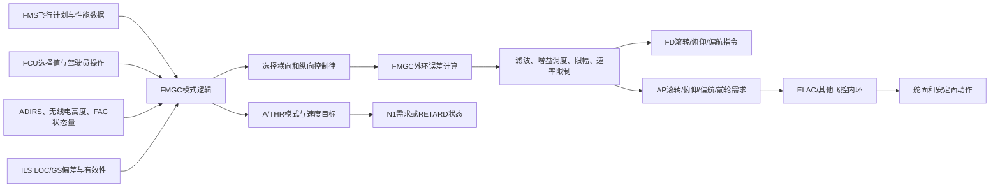

# A320 起飞与降落制导信号生成过程及输出量

## 1. 文档范围

本文分析对象是当前工程中的 FlyByWire A32NX A320 模型，重点文件为：

- `fbw-a32nx/src/wasm/fbw_a320/src/model/FmgcComputer.cpp`
- `fbw-a32nx/src/wasm/fbw_a320/src/model/FmgcOuterLoops.cpp`
- `fbw-a32nx/src/wasm/fbw_a320/src/model/FmgcComputer_types.h`
- `fbw-a32nx/src/wasm/fbw_a320/src/model/ElacComputer.cpp`
- `fbw-a32nx/src/wasm/fbw_a320/src/model/PitchNormalLaw.cpp`
- `fbw-a32nx/src/wasm/fbw_a320/src/FlyByWireInterface.cpp`

这里的“制导信号”是 FMGC（飞行管理与制导计算机） 根据飞行计划、FCU（飞行控制组件）选择值、ILS（仪表着陆系统）偏差和飞机状态生成的目标指令，不等同于最终升降舵、副翼、方向舵的实际偏角。

需要特别区分四层信号：

1. **参考量**：目标速度、目标航迹、目标高度、跑道方向、LOC/GS基准等。
2. **制导指令**：目标滚转、俯仰、偏航和前轮转向需求。
3. **飞控内环指令**：ELAC等飞控计算机根据制导指令和飞机反馈生成的控制需求。
4. **执行机构动作**：副翼、扰流板、升降舵、方向舵、可调水平安定面和前轮的实际动作。

> 说明：源代码总线采用航空常用单位，例如度、节、英尺。本文物理量说明以SI单位为主，同时保留源代码字段名及其原生单位，便于核对代码。工程模型是开源仿真实现，不应视为真实A320专有控制律的完整官方定义。

---

## 2. 制导信号总体生成链路



FMGC外环的主要输入可以归纳为：

| 类别 | 主要输入量 | SI单位 |
|---|---|---:|
| 姿态 | 俯仰角、滚转角、航向角、航迹角 | rad |
| 角速度 | 俯仰、滚转、偏航角速度 | rad/s |
| 速度 | 指示空速、真空速、地速、目标速度 | m/s |
| 高度 | 气压高度、指示高度、无线电高度 | m |
| 垂直运动 | 垂直速度 | m/s |
| 加速度 | 机体系纵向、横向、法向加速度 | m/s² |
| ILS | LOC偏差、GS偏差、LOC航向、GS角 | rad |
| FMS航迹 | 横航迹误差XTK、航迹角误差TAE | m、rad |
| FMS垂直剖面 | 目标高度、目标垂直速度 | m、m/s |
| 限制量 | VLS、VMAX、滚转限制 | m/s、rad |
| 构型状态 | 地面状态、发动机状态、AP/FD/A/THR状态 | 布尔/枚举 |

FMGC不会固定使用同一个控制器。状态机先选择控制律，再由外环调用对应算法：

| 横向控制律 | 作用 |
|---|---|
| HDG | 跟踪选定航向 |
| TRACK | 跟踪选定航迹 |
| HPATH | 根据FMS航迹误差跟踪飞行计划 |
| LOC_CPT | 截获航向道 |
| LOC_TRACK | 跟踪航向道 |
| ROLL_OUT | 跑道方向/中心线跟踪 |

| 纵向控制律 | 作用 |
|---|---|
| ALT_HOLD / ALT_ACQ | 高度保持/截获 |
| SPD_MACH | 以俯仰控制速度或马赫数 |
| VS / FPA | 垂直速度/航迹角控制 |
| GS | 下滑道截获与跟踪 |
| FLARE | 拉平和接地垂直速度整形 |
| SRS | 起飞或复飞速度基准系统 |
| VPATH | FMS垂直剖面跟踪 |

---

# 第一部分：起飞阶段

## 3. 起飞阶段总览

| 阶段 | 典型横向模式 | 典型纵向模式 | 主要制导目标 | 主要输出 |
|---|---|---|---|---|
| 起飞准备 | RWY/NAV预位 | SRS预位 | 建立跑道、V2和高度基准 | 预位状态、目标速度、FMA状态 |
| 推力建立与滑跑 | RWY | SRS | 跑道方向和起飞安全速度 | 偏航FD、俯仰FD、速度目标、推力模式 |
| 抬轮 | RWY | SRS | 按SRS速度/能量要求给出俯仰指引 | 俯仰FD；飞行员杆量进入ELAC抬轮律 |
| 离地初始爬升 | RWY TRK | SRS | 保持离地航迹和V2附近速度 | 滚转FD、俯仰FD、AP姿态需求 |
| NAV接通 | NAV | SRS | 截获FMS离场航迹 | 横向航迹指令、俯仰指令 |
| 减推力高度 | NAV | SRS | 转入爬升推力，继续保持SRS速度 | LVR CLB提示、N1/推力模式 |
| 加速高度以上 | NAV | CLB/OP CLB | 加速、收构型、爬升剖面跟踪 | 滚转、俯仰、速度和推力指令 |

---

## 4. 阶段一：起飞准备和制导基准建立

### 4.1 输入来源

起飞前FMGC需要形成以下参考量：

| 参考量 | 来源 | 用途 |
|---|---|---|
| 跑道磁航向 | FMS跑道数据或ILS LOC方向 | RWY和RWY TRK基准 |
| V2 | FMS性能输入 | SRS最基本速度参考 |
| 管理速度 | FMS性能计算 | 后续加速和爬升速度参考 |
| 推力减小高度 | FMS输入 | 触发起飞推力向爬升推力转换 |
| 加速高度 | FMS输入 | 触发SRS向CLB/其他纵向模式转换 |
| 单发加速高度 | FMS输入 | 发动机失效时的模式转换参考 |
| 初始高度目标 | FCU选择高度或FMS约束 | 初始爬升限制 |
| 离场航迹 | FMS飞行计划 | NAV模式横向参考 |

### 4.2 跑道航向记忆

FMGC将有效跑道方向保存为 `rwy_hdg_memo`。该量用于：

- RWY模式的地面方向基准；
- RWY TRK模式离地后的航迹基准；
- LOC捕获和着陆阶段的跑道方向比较；
- A总线的 `runway_hdg_memorized_deg` 输出。

### 4.3 SRS预位和起飞阶段触发

模型在SRS已建立并满足下列任一条件后进入起飞阶段：

- 两台发动机N1达到约70%；
- 地速绝对值超过约 \(46.30\ \text{m/s}\)（代码值90 kt）；
- 条件需经过约0.2 s确认。

进入起飞状态后，FMGC将纵向活动控制律选择为SRS。

### 4.4 本阶段输出

| 输出量 | 含义 | SI单位 |
|---|---|---:|
| 跑道航向记忆值 | 后续RWY/RWY TRK基准 | rad |
| SRS预位/活动状态 | 纵向模式状态 | 枚举 |
| RWY/NAV预位状态 | 横向模式状态 | 枚举 |
| PFD目标速度 | 飞行员速度参考 | m/s |
| FMA离散字 | 显示SRS、RWY、NAV等模式 | 位字段 |

---

## 5. 阶段二：推力建立和跑道滑跑

### 5.1 模式选择

推力手柄进入起飞区间后：

- 纵向模式进入 **SRS**；
- 横向满足跑道/ILS条件时进入 **RWY**；
- NAV可以保持预位，等待离地后满足截获条件。

在模型内部，RWY与ROLL OUT共用跑道中心线类横向控制律，但起飞时自动驾驶通常未接通，因此输出主要作为FD偏航指引，不代表模型自动操纵前轮起飞。

### 5.2 横向制导信号生成

RWY制导使用以下信息：

1. 记忆跑道航向；
2. 当前真航向、磁航向和航迹；
3. LOC偏差及其有效性；
4. 偏航角速度；
5. 侧滑角；
6. 地速和跑道距离信息。

其处理过程可以概括为：

```text
跑道/LOC偏差
    ↓
偏差滤波与符号判断
    ↓
跑道航向误差 + LOC横向误差 + 偏航阻尼
    ↓
增益调度、积分修正、限幅
    ↓
偏航FD指令 βFD
```

如果AP未接通，前轮需求量被抑制为零或无效；飞行员根据跑道中心线、方向舵和FD指引保持方向。

### 5.3 纵向SRS参考速度生成

双发正常时，模型区分内部控制目标和PFD显示目标：

\[
V_{SRS,control}=V_2+5.144\ \text{m/s}
\]

\[
V_{SRS,PFD}=V_2
\]

其中 \(5.144\ \text{m/s}\) 对应代码中的10 kt。

单发情况下：

\[
V_{SRS}=\max
\left[
V_2,\ 
\min\left(V_2+7.717\ \text{m/s},V_{memo,EO}\right)
\right]
\]

其中 \(7.717\ \text{m/s}\) 对应15 kt，\(V_{memo,EO}\) 是发动机失效前后记忆的速度。

### 5.4 自动推力输出

起飞滑跑阶段A/THR主要识别推力手柄位置并形成模式：

- MAN TOGA；
- MAN FLEX；
- MAN MCT；
- MAN THR。

此时推力手柄位置决定最大允许推力等级，FMGC输出：

- A/THR模式离散字；
- 目标N1百分比；
- FMA推力模式；
- 必要时的推力手柄提示。

### 5.5 本阶段主要输出

| 输出量 | 作用 | SI单位 |
|---|---|---:|
| \(\beta_{FD}\) | 跑道方向偏航指引 | rad |
| \(\theta_{FD}\) | SRS俯仰指引，地面阶段受抑制或处于待用状态 | rad |
| \(V_{target}\) | SRS/PFD速度目标 | m/s |
| A/THR模式 | MAN TOGA/FLEX等 | 枚举 |
| \(N1_c\) | 发动机转速需求 | % |

---

## 6. 阶段三：抬轮

### 6.1 FMGC在抬轮中的作用

FMGC的SRS不是一个固定俯仰角发生器。它根据速度误差、垂直运动、姿态和安全限制计算动态俯仰指引。

主要反馈量包括：

- 当前指示空速 \(V_{IAS}\)；
- SRS目标速度 \(V_c\)；
- 真空速和地速；
- 垂直速度；
- 当前俯仰角、滚转角；
- 俯仰角速度；
- VLS和VMAX；
- 发动机状态。

SRS首先构造速度误差：

\[
e_V=V_c-V_{IAS}
\]

再将速度误差、垂直速度和姿态动态转换成多个候选俯仰修正量，通过三输入投票器选择中间值，并经过：

1. 速度保护；
2. 俯仰上下限；
3. 指令速率限制；
4. 滞后滤波；
5. 模式切换平滑处理。

最终得到俯仰FD指令 \(\theta_{FD}\)；AP接通时还会形成 \(\theta_{AP}\)。

### 6.2 ELAC抬轮律

飞行员实际抬轮时，侧杆输入进入ELAC俯仰正常法则中的抬轮控制分支。该分支根据：

- 侧杆纵向输入；
- 俯仰角；
- 俯仰角速度；
- 空速；
- 地面/空中状态；

生成俯仰率或升降舵相关控制需求。

因此抬轮阶段存在两条并行链路：

```text
FMGC SRS → 俯仰FD杆 → 飞行员观察

飞行员侧杆 → ELAC抬轮律 → 升降舵/安定面
```

不能把SRS俯仰FD直接解释成升降舵偏角，也不能把抬轮律简单称为PID。

---

## 7. 阶段四：离地后的SRS和RWY TRK

### 7.1 横向RWY TRK参考生成

RWY TRK在进入时记忆当前磁航迹，并将其作为目标航迹：

\[
\chi_c=\chi_{memo}
\]

外环计算航迹误差：

\[
e_\chi=\operatorname{wrap}(\chi_c-\chi)
\]

再根据真空速调度控制增益，并加入偏航角速度阻尼，形成目标滚转量。

输出链路为：

```text
记忆航迹 - 当前航迹
    ↓
角度环绕处理
    ↓
速度增益调度 + 偏航阻尼
    ↓
滚转限制和速率限制
    ↓
φFD、φAP
```

### 7.2 纵向SRS继续工作

离地后SRS使用速度误差和飞机能量状态控制俯仰：

- 速度低于目标时，限制继续增大俯仰；
- 速度高于目标时，允许增加俯仰以恢复速度；
- 同时受VLS、VMAX和姿态限制保护；
- 单发时使用单发SRS速度规则。

### 7.3 输出量

| 输出量 | 含义 | SI单位 |
|---|---|---:|
| \(\phi_{FD}\) | 横向FD滚转指引 | rad |
| \(\theta_{FD}\) | SRS纵向FD俯仰指引 | rad |
| \(\phi_{AP}\) | AP接通时的滚转目标 | rad |
| \(\theta_{AP}\) | AP接通时的俯仰目标 | rad |
| \(V_{target}\) | 双发或单发SRS速度目标 | m/s |

---

## 8. 阶段五：NAV截获和离场航迹跟踪

### 8.1 NAV制导输入

FMS向FMGC提供：

- 横航迹误差XTK；
- 航迹角误差TAE；
- FMS前馈滚转指令；
- 最大允许滚转角；
- 地速。

XTK在代码中以海里输入，换算为SI单位：

\[
1\ \text{nmi}=1852\ \text{m}
\]

### 8.2 横向指令生成

模型中的HPATH/NAV控制结构可概括为：

\[
\phi_c=
\phi_{FF}
-
K_{TAE}e_{TAE}
-
K_{XTK}\frac{e_{XTK}}{V_G}
\]

实际生成代码还包含：

- 地速缩放；
- 滚转限制；
- 模式切换平滑；
- 速率限制；
- 滞后滤波。

### 8.3 输出量

| 输出量 | 含义 |
|---|---|
| \(\phi_{FD}\) | 给飞行员的NAV滚转指引 |
| \(\phi_{AP}\) | 自动驾驶横向姿态需求 |
| NAV活动状态 | FMA横向活动模式 |
| XTK/TAE相关内部量 | 航迹跟踪误差和前馈量 |

---

## 9. 阶段六：减推力高度和加速高度

### 9.1 减推力高度

当飞机达到FMS输入的推力减小高度后，FMGC形成推力手柄提示和A/THR模式转换条件：

```text
指示高度 ≥ 推力减小高度
    ↓
检查发动机状态和当前纵向模式
    ↓
产生LVR CLB或LVR MCT提示
    ↓
推力手柄进入相应卡位
    ↓
THR CLB或THR MCT
```

### 9.2 加速高度

达到正常或单发加速高度，或纵向模式已切换到CLB、OP CLB、VS、FPA、ALT等模式时，模型退出起飞飞行阶段。

纵向制导由SRS切换为：

- CLB；
- OP CLB；
- ALT ACQ；
- ALT HOLD；
- VS/FPA。

此后飞机开始加速并按构型计划收襟翼/缝翼。

### 9.3 起飞制导输出总结

| 输出类别 | 主要输出量 |
|---|---|
| 模式输出 | RWY、RWY TRK、NAV、SRS、CLB、OP CLB、ALT等 |
| FD输出 | 滚转、俯仰、偏航指令 |
| AP输出 | 滚转、俯仰、偏航需求 |
| 速度输出 | V2、SRS控制目标、PFD目标速度、管理速度 |
| 推力输出 | A/THR模式、N1需求、LVR CLB/LVR MCT提示 |
| 状态输出 | AP/FD/A/THR接通、模式有效性、FMA离散字 |

---

# 第二部分：进近和着陆阶段

## 10. 进近着陆阶段总览

| 阶段 | 横向模式 | 纵向模式 | 制导基准 | 主要输出 |
|---|---|---|---|---|
| 初始进近 | NAV | DES/FINAL DES/ALT | FMS航迹和垂直剖面 | 滚转、俯仰、速度目标 |
| ILS预位 | LOC预位 | GS预位 | ILS有效性和偏差 | 预位状态、FMA |
| LOC截获 | LOC CPT | 原纵向模式或GS预位 | LOC偏差、跑道方向 | 滚转指令 |
| LOC跟踪与GS截获 | LOC TRACK | GS CPT | LOC/GS偏差 | 滚转、俯仰指令 |
| GS跟踪 | LOC TRACK | GS TRACK | 下滑道角和垂直运动 | 滚转、俯仰、速度/N1 |
| LAND | LAND | LAND/GS律 | LOC、GS、无线电高度 | 自动着陆姿态和偏航指令 |
| FLARE | LAND/ALIGN | FLARE | 无线电高度和下沉率 | 拉平俯仰、RETARD |
| 接地滑跑 | ROLL OUT | ROLL OUT/地面 | 跑道中心线、偏航率 | 偏航和前轮转向需求 |

---

## 11. 阶段一：初始进近和垂直剖面跟踪

### 11.1 横向NAV

初始进近阶段仍可使用NAV/HPATH控制：

- FMS横航迹误差XTK；
- 航迹角误差TAE；
- FMS前馈滚转；
- 当前地速；
- 滚转限制。

生成过程与离场NAV相同，输出 \(\phi_{FD}\) 和 \(\phi_{AP}\)。

### 11.2 纵向DES或FINAL DES

纵向参考来自：

- FMS目标高度剖面；
- FMS目标垂直速度；
- FCU选择高度；
- 当前高度和垂直速度；
- 当前速度、VLS和VMAX。

FINAL DES活动时，外环使用垂直航迹控制，并对部分增益进行专门调度。其一般结构为：

\[
e_H=H_c-H
\]

\[
\dot H_c=f(e_H,\text{FMS剖面},V_G)
\]

\[
\theta_c=f(\dot H_c-\dot H,V_{TAS},\theta,q)
\]

输出经速度保护、俯仰限幅和速率限制后形成FD/AP俯仰指令。

### 11.3 进近速度目标

当前模型将以下速度量送入FMGC：

- `v_app_kts`；
- `v_managed_kts`；
- VLS；
- VMAX；
- FCU选择速度；
- 上下速度裕度。

但在当前生成的 `FmgcComputer.cpp` 中，`v_app_kts`没有直接参与主要目标速度计算；活动速度目标主要由管理速度或FCU选择速度形成，并由VLS/VMAX限制。因此不能仅根据输入字段名断言B总线的进近目标速度就是动态VAPP。

---

## 12. 阶段二：LOC和GS预位

### 12.1 ILS信号有效性检查

FMGC在允许LOC/GS截获前检查：

- 本侧或对侧ILS数据有效；
- LOC偏差有效；
- GS偏差有效；
- LAND/LOC/GS已由驾驶员预位；
- 当前飞行阶段和无线电高度满足条件；
- 当前模式没有被复飞、TCAS或其他优先模式覆盖。

### 12.2 预位输出

预位阶段不一定立即改变活动控制律，主要输出：

- `loc_armed`；
- `glide_armed`；
- `land_armed`；
- FMA预位显示；
- ILS数据有效性和调谐状态。

---

## 13. 阶段三：LOC截获

### 13.1 截获判据

LOC截获逻辑使用：

- 当前磁航向；
- 记忆跑道航向；
- 当前滚转角；
- LOC偏差；
- 上一周期的LOC滚转候选指令 \(\phi_{LOC,c}\)；
- ILS有效性；
- LOC预位状态。

模型先计算飞机航向与跑道方向的最短角差，再检查：

1. 航向与跑道夹角小于 \(2.007\ \text{rad}\)（代码值115°）；
2. LOC偏差已经足够小或正在向中心线收敛；
3. 当前滚转方向与所需截获方向一致；
4. 条件经过确认计时，防止瞬时跳变。

代码还包含以下分段判据：

- \(0.436\ \text{rad}\)（25°）；
- \(0.262\ \text{rad}\)（15°）；
- \(0.0873\ \text{rad}\)（5°）；
- LOC误差约 \(0.1745\ \text{rad}\)、\(0.0335\ \text{rad}\) 和 \(0.0192\ \text{rad}\)，分别对应代码中的10°、1.92°和1.1°。

这些值属于模型的截获逻辑门限，不是飞行员操作程序中的标准截获角要求。

### 13.2 LOC滚转候选指令

外环首先构造：

- LOC航向/跑道方向误差；
- 当前真航迹与LOC方向误差；
- LOC横向偏差；
- DME距离；
- 地速。

其结构可以概括为：

\[
\phi_{LOC,c}
=
\left[
K_\chi e_\chi+
K_{LOC}\frac{D\sin(e_{LOC})}{V_G}
\right]
K_VV_G
\]

其中：

- \(e_\chi\) 为航迹与LOC方向误差；
- \(e_{LOC}\) 为航向道角偏差；
- \(D\) 为DME或FMS提供的LOC距离；
- \(V_G\) 为地速；
- 各增益随速度、模式和限制量调度。

### 13.3 LOC CPT输出

LOC CPT活动时，横向控制律直接选用 \(\phi_{LOC,c}\)，之后进行：

- 滚转角限制；
- 指令变化率限制；
- 滞后滤波；
- FD/AP接通平滑。

输出：

- \(\phi_{FD}\)；
- \(\phi_{AP}\)；
- LOC CPT活动状态；
- `Phi_loc_c`内部诊断量。

---

## 14. 阶段四：LOC跟踪和GS截获

### 14.1 LOC TRACK转换

LOC CPT活动后，当LOC偏差绝对值低于模型设定门限并持续确认后，状态机进入LOC TRACK。

LOC TRACK除基本LOC滚转指令外，还加入低高度增强反馈：

- 真航向与跑道方向误差；
- 磁航迹修正；
- LOC偏差及变化率；
- 偏航角速度；
- 侧滑角；
- 无线电高度调度。

低高度时这些反馈逐渐增强，使飞机更精确地对准跑道方向。

### 14.2 GS截获判据

GS只有在LOC CPT或LOC TRACK有效时才允许截获。模型处理过程为：

```text
GS偏差与有效性
    ↓
一阶滞后滤波
    ↓
判断偏差是否减小、是否进入截获窗口
    ↓
LOC已截获/跟踪检查
    ↓
确认计时和状态锁存
    ↓
GS CPT
```

GS截获判据同时考虑：

- 滤波后的GS偏差；
- 当前GS偏差绝对值；
- 偏差是否向零收敛；
- LOC模式状态；
- ILS有效性；
- 对侧FMGC同步状态。

### 14.3 GS CPT俯仰指令生成

GS外环使用：

- GS偏差及其导数；
- 无线电高度；
- 垂直速度；
- 地速；
- 俯仰角速度；
- 当前飞行航迹角；
- ILS下滑道角；
- VLS、目标速度和VMAX。

实际航迹角近似为：

\[
\gamma=\arctan\left(\frac{\dot H}{V_G}\right)
\]

GS偏差经过高度增益调度。随着无线电高度降低，模型改变偏差和偏差率的权重，以提高近地跟踪精度并限制过度修正。

---

## 15. 阶段五：GS TRACK稳定下滑

### 15.1 模式转换

GS CPT保持一段确认时间，并且GS偏差进入较小范围后，状态机进入GS TRACK。

### 15.2 GS TRACK制导算法

GS TRACK在GS CPT控制基础上增加下滑道角与实际航迹角的误差：

\[
e_\gamma=\gamma_{GS}-\gamma
\]

外环形成三组候选纵向控制量，主要来源为：

1. GS偏差和GS偏差率；
2. 下滑道角与实际航迹角误差；
3. 垂直速度、俯仰角速度和动态补偿。

模型使用三输入投票器选择中间值：

\[
u_{GS}=\operatorname{median}(u_1,u_2,u_3)
\]

这样可以抑制单个候选通道的异常大指令。

然后加入速度保护：

- 目标速度不得低于VLS保护要求；
- 目标速度不得超过VMAX保护要求；
- 速度偏离保护可以限制GS俯仰修正。

最后经过俯仰限制、速率限制和滤波，得到：

- \(\theta_{FD}\)；
- \(\theta_{AP}\)。

### 15.3 A/THR速度控制

GS或FLARE控制律活动时，A/THR可以进入SPEED模式。A/THR根据：

- 目标速度；
- 当前指示空速；
- VLS和VMAX；
- 纵向加速度；
- 法向加速度；
- 俯仰、滚转和垂直速度；

形成N1修正需求。

输出包括：

- SPEED模式；
- 目标N1；
- N1命令百分比；
- A/THR离散状态。

---

## 16. 阶段六：LAND和ALIGN

### 16.1 LAND进入条件

模型在以下条件持续满足后锁存LAND：

- GS TRACK活动；
- LOC TRACK活动；
- 无线电高度低于参数设定门限；
- ILS和双FMGC协调条件满足；
- 条件经过确认节点。

源代码中的无线电高度门限是参数化常数，生成文件片段没有给出具有明确工程含义的直接数值，因此本文不虚构该门限。

### 16.2 LAND横向控制

LAND阶段继续使用LOC TRACK的精确跑道对准控制，并随无线电高度降低增强：

- LOC偏差反馈；
- 跑道航向误差；
- 偏航角速度阻尼；
- 侧滑角反馈。

### 16.3 ALIGN子模式

低高度并满足拉平条件时，横向状态机激活ALIGN子模式。其目的不是改变下滑道，而是使机头方向、航迹和跑道方向在接地前保持协调。

主要输出：

- 滚转指令；
- 偏航/侧滑指令；
- LAND和ALIGN模式状态；
- 自动着陆能力离散状态。

---

## 17. 阶段七：FLARE和RETARD

### 17.1 FLARE触发

外环根据无线电高度和无线电高度变化率形成 `condition_Flare`。模型在以下情况之一满足时允许拉平条件成立：

- 无线电高度低于 \(24.384\ \text{m}\)（代码值80 ft），且高度与下沉趋势满足动态判据；
- 无线电高度低于或等于 \(12.802\ \text{m}\)（代码值42 ft）；
- FLARE状态已经锁存。

模式逻辑还要求LAND活动，并通过确认节点后进入FLARE。

### 17.2 无线电高度下沉率估计

模型对无线电高度信号进行超前滞后处理，得到无线电高度下沉率 \(\dot H_R\)，再利用惯性垂直速度和地速相关限制抑制噪声。

### 17.3 指数型拉平轨迹

进入FLARE的瞬间，模型根据当前无线电高度和下沉率计算时间常数：

\[
\tau=
\frac{H_R}
{|\dot H_R|-0.762}
\]

其中：

- \(H_R\) 采用m；
- \(\dot H_R\) 采用m/s；
- \(0.762\ \text{m/s}\) 对应代码中的2.5 ft/s。

随后计算高度偏置：

\[
H_{bias}=\tau|\dot H_R|-H_R
\]

目标下沉率为：

\[
\dot H_c=
-\frac{H_R+H_{bias}}{\tau}
\]

因此目标下沉率会随着无线电高度降低逐渐减小，形成指数型拉平轨迹，而不是简单保持固定俯仰角。

### 17.4 拉平俯仰修正量

FLARE律生成四个主要俯仰修正分量：

| 修正量 | 来源 | 作用 |
|---|---|---|
| \(\Delta\theta_{\dot H}\) | 目标与实际下沉率误差 | 跟踪拉平垂直轨迹 |
| \(\Delta\theta_{b_z}\) | 法向加速度 | 抑制法向过载变化 |
| \(\Delta\theta_{b_x}\) | 纵向加速度高通/洗出量 | 补偿推力和纵向动态 |
| \(\Delta\theta_{\beta}\) | 侧滑相关量 | 补偿侧滑对纵向姿态的耦合 |

AP拉平俯仰需求可概括为：

\[
\Delta\theta_{FLARE}
=
\Delta\theta_{b_z}
+\Delta\theta_{b_x}
+K_{\dot H}\Delta\theta_{\dot H}
+\Delta\theta_\beta
\]

该结果经过限幅、速率限制和滤波后叠加到当前俯仰姿态，形成 \(\theta_{AP}\)。

### 17.5 RETARD

当A/THR的拉平/着陆条件满足后，模型将推力指令切换到 `RETARD` 状态。该状态用于要求推力收至慢车，并在FMA/A/THR状态中输出。

主要输出：

- FLARE模式；
- 目标下沉率；
- 无线电高度下沉率；
- 四个拉平俯仰修正量；
- 俯仰FD/AP指令；
- RETARD状态；
- THR IDLE或相关A/THR模式。

---

## 18. 阶段八：接地和ROLL OUT

### 18.1 ROLL OUT进入条件

模型在以下条件满足并确认后进入ROLL OUT：

- LAND活动；
- 无线电高度低于参数门限；
- BSCU有效时，至少一个主轮速度超过约 \(36.01\ \text{m/s}\)（代码值70 kt）；
- BSCU无效时使用备用接地判据。

### 18.2 跑道中心线控制

ROLL OUT外环综合：

- LOC偏差；
- LOC偏差积分；
- 跑道真航向；
- 当前真航向；
- 偏航角速度；
- 侧滑角；
- `zeta`方向控制反馈；
- AP接通状态。

处理过程为：

```text
LOC中心线偏差
    ↓
距离/速度调度 + 偏差积分
    ↓
跑道航向误差
    ↓
偏航率阻尼 + 侧滑反馈
    ↓
βAP与前轮转向需求
    ↓
限幅、滤波、有效性管理
```

### 18.3 输出量

| 输出量 | 含义 | SI单位 |
|---|---|---:|
| \(\beta_{FD}\) | 偏航FD指引 | rad |
| \(\beta_{AP}\) | 自动驾驶偏航/侧滑需求 | rad |
| \(\delta_{NW,c}\) | 前轮转向需求 | rad |
| \(\phi_{AP}\) | 接地前后横向姿态需求 | rad |
| ROLL OUT状态 | FMA活动模式 | 枚举 |

前轮需求量只在自动着陆/自动驾驶相关条件下有效。它仍是FMGC需求量，不是最终前轮实际角度；BSCU和转向执行机构还会施加自身限制。

---

# 第三部分：制导输出量总表

## 19. FMGC外环直接输出

| 物理量 | 代码字段 | 含义 | SI单位 | 源代码原生单位 |
|---|---|---|---:|---:|
| LOC滚转候选 | `Phi_loc_c` | LOC截获/跟踪内部滚转目标 | rad | deg |
| 前轮转向需求 | `Nosewheel_c` | ROLL OUT前轮目标 | rad | deg |
| FD俯仰指令 | `flight_director.Theta_c_deg` | PFD纵向指引 | rad | deg |
| FD滚转指令 | `flight_director.Phi_c_deg` | PFD横向指引 | rad | deg |
| FD偏航指令 | `flight_director.Beta_c_deg` | 跑道/着陆偏航指引 | rad | deg |
| AP俯仰需求 | `autopilot.Theta_c_deg` | 送飞控内环的俯仰目标 | rad | deg |
| AP滚转需求 | `autopilot.Phi_c_deg` | 送飞控内环的滚转目标 | rad | deg |
| AP偏航需求 | `autopilot.Beta_c_deg` | 送飞控内环的偏航/侧滑目标 | rad | deg |
| FLARE条件 | `condition_Flare` | 拉平触发条件 | 布尔 | 布尔 |
| 无线电下沉率 | `H_dot_radio_fpm` | RA估算下沉率 | m/s | ft/min |
| 拉平目标下沉率 | `H_dot_c_fpm` | FLARE目标垂直速度 | m/s | ft/min |
| 下沉率俯仰修正 | `delta_Theta_H_dot_deg` | FLARE轨迹修正 | rad | deg |
| 法向加速度修正 | `delta_Theta_bz_deg` | FLARE过载补偿 | rad | deg |
| 纵向加速度修正 | `delta_Theta_bx_deg` | FLARE纵向动态补偿 | rad | deg |
| 侧滑耦合修正 | `delta_Theta_beta_c_deg` | FLARE侧滑补偿 | rad | deg |

---

## 20. A总线主要制导输出

| 代码字段 | 输出内容 | SI解释 |
|---|---|---|
| `pfd_sel_spd_kts` | PFD目标速度 | m/s |
| `runway_hdg_memorized_deg` | 记忆跑道航向 | rad |
| `roll_fd_command` | FD滚转指令 | rad |
| `pitch_fd_command` | FD俯仰指令 | rad |
| `yaw_fd_command` | FD偏航指令 | rad |
| `delta_p_ail_voted_cmd_deg` | 投票后的滚转需求 | rad |
| `delta_p_splr_voted_cmd_deg` | 投票后的扰流板滚转需求 | rad |
| `delta_r_voted_cmd_deg` | 投票后的方向舵/偏航需求 | rad |
| `delta_nosewheel_voted_cmd_deg` | 投票后的前轮转向需求 | rad |
| `delta_q_voted_cmd_deg` | 投票后的俯仰需求 | rad |
| `n1_command_percent` | N1需求 | % |
| `track_deg` | 当前航迹 | rad |
| `heading_deg` | 当前航向 | rad |
| `fpa_deg` | 当前飞行航迹角 | rad |
| `vertical_speed_ft_min` | 当前垂直速度 | m/s |
| `discrete_word_1...7` | 模式、预位、能力和有效性状态 | 位字段 |

“voted”表示双FMGC/FCU体系中的指令选择或投票结果，不代表已经转换成实际舵面偏角。

---

## 21. B总线主要控制需求

| 代码字段 | 输出内容 | SI解释 |
|---|---|---|
| `delta_p_ail_cmd_deg` | 副翼通道滚转需求 | rad |
| `delta_p_splr_cmd_deg` | 扰流板通道滚转需求 | rad |
| `delta_r_cmd_deg` | 偏航/方向舵需求 | rad |
| `delta_nose_wheel_cmd_deg` | 前轮转向需求 | rad |
| `delta_q_cmd_deg` | 俯仰需求 | rad |
| `fg_radio_height_ft` | 无线电高度 | m |
| `approach_spd_target_kn` | 进近速度目标字段 | m/s |
| `n1_left_percent` | 左发N1相关输出 | % |
| `n1_right_percent` | 右发N1相关输出 | % |

当前版本中 `approach_spd_target_kn` 被赋为模型常数，不能把它直接解释为实时变化的VAPP。动态速度目标应优先查看 `pfd_sel_spd_kts`、`spd_target_kts`、`v_managed_kts`、VLS和VMAX链路。

---

## 22. FD与AP输出的区别

| 项目 | FD输出 | AP输出 |
|---|---|---|
| 使用者 | 飞行员 | 飞控计算机 |
| 表现形式 | PFD指引杆 | 总线角度需求 |
| 是否直接驱动舵面 | 否 | 否，仍需飞控内环 |
| 主要量 | \(\theta_{FD},\phi_{FD},\beta_{FD}\) | \(\theta_{AP},\phi_{AP},\beta_{AP},\delta_{NW,c}\) |
| AP未接通时 | 仍可显示 | 通常被抑制、冻结或标记无效 |

FMGC B总线被送入ELAC。ELAC检查ARINC 429状态字、AP接通状态和指令有效性后，才把滚转/俯仰需求用于自身控制律。

---

## 23. 单位换算表

| 源代码单位 | SI单位 | 换算关系 |
|---|---|---|
| kt | m/s | \(1\ \text{kt}=0.514444\ \text{m/s}\) |
| ft | m | \(1\ \text{ft}=0.3048\ \text{m}\) |
| ft/min | m/s | \(1\ \text{ft/min}=0.00508\ \text{m/s}\) |
| nmi | m | \(1\ \text{nmi}=1852\ \text{m}\) |
| deg | rad | \(1^\circ=\pi/180\ \text{rad}\) |
| deg/s | rad/s | \(1^\circ/\text{s}=\pi/180\ \text{rad/s}\) |
| lb | kg | \(1\ \text{lb}=0.45359237\ \text{kg}\) |

---

## 24. 制导信号的有效性和安全处理

所有制导量在输出前并非只经过一次比例计算，而是包含以下处理：

1. **数据有效性检查**：检查ADIRS、ILS、RA、FAC、BSCU和对侧FMGC数据。
2. **ARINC 429状态管理**：使用SSM标记正常、无计算数据或失效状态。
3. **模式优先级**：复飞、TCAS、LAND等模式可以覆盖普通NAV、VS或DES模式。
4. **确认节点**：LOC、GS、LAND、FLARE、ROLL OUT等转换需持续满足条件。
5. **状态锁存**：避免模式在门限附近反复跳变。
6. **低通/滞后滤波**：抑制ILS偏差和传感器噪声。
7. **洗出/高通处理**：提取加速度或动态变化量。
8. **增益调度**：根据空速、地速、无线电高度和重量改变控制增益。
9. **饱和限制**：限制最大滚转、俯仰、偏航和前轮需求。
10. **速率限制**：防止模式切换时指令突变。
11. **候选量投票**：GS、SRS等控制律从多个候选控制量中选取中间值。
12. **双通道协调**：本侧和对侧FMGC进行模式同步及指令选择。

---

## 25. 起飞与着陆制导信号最终归纳

### 25.1 起飞

```text
V2、跑道航向、FMS离场航迹、推力/加速高度
    ↓
RWY + SRS预位
    ↓
推力建立：RWY + SRS
    ↓
抬轮：SRS给俯仰FD，飞行员侧杆进入ELAC抬轮律
    ↓
离地：RWY TRK + SRS
    ↓
NAV截获：XTK/TAE生成滚转指令
    ↓
减推力高度：A/THR转爬升推力
    ↓
加速高度：SRS退出，进入CLB/OP CLB等模式
```

起飞主要输出为：

- SRS目标速度；
- FD滚转、俯仰、偏航指令；
- AP滚转、俯仰、偏航需求；
- NAV航迹指令；
- A/THR模式和N1需求；
- RWY、RWY TRK、NAV、SRS、CLB等模式状态。

### 25.2 着陆

```text
FMS进近航迹/垂直剖面
    ↓
LOC与GS预位
    ↓
LOC CPT：航向道截获
    ↓
LOC TRACK：航向道精确跟踪
    ↓
GS CPT：下滑道截获
    ↓
GS TRACK：下滑道角与实际航迹角闭环
    ↓
LAND：低高度自动着陆协调
    ↓
FLARE：无线电高度指数型拉平轨迹
    ↓
RETARD：推力收慢车
    ↓
ROLL OUT：LOC/跑道航向/偏航率生成偏航和前轮需求
```

着陆主要输出为：

- LOC滚转候选和滚转FD/AP指令；
- GS/FLARE俯仰FD/AP指令；
- 偏航和侧滑指令；
- 前轮转向需求；
- 目标速度和N1需求；
- 拉平目标下沉率及四个俯仰修正分量；
- LOC、GS、LAND、FLARE、ROLL OUT和A/THR模式状态。

---

## 26. 代码核对位置

| 内容 | 文件及位置 |
|---|---|
| FMGC外环输入和输出接口 | `FmgcOuterLoops.cpp:2151-2177` |
| LOC滚转候选生成 | `FmgcOuterLoops.cpp:2324-2379` |
| NAV/HPATH横向制导 | `FmgcOuterLoops.cpp:2466-2475` |
| LOC TRACK低高度增强 | `FmgcOuterLoops.cpp:2482-2524` |
| ROLL OUT偏航和前轮制导 | `FmgcOuterLoops.cpp:2552-2715` |
| FLARE下沉率轨迹 | `FmgcOuterLoops.cpp:3108-3186` |
| GS截获/跟踪外环 | `FmgcOuterLoops.cpp:3474-3556` |
| SRS外环 | `FmgcOuterLoops.cpp:3840-4069` |
| AP纵向控制律选择 | `FmgcOuterLoops.cpp:4484-4527` |
| FLARE触发条件 | `FmgcOuterLoops.cpp:4563-4565` |
| LAND、ALIGN和ROLL OUT状态 | `FmgcComputer.cpp:1834-1903` |
| LOC CPT和LOC TRACK状态 | `FmgcComputer.cpp:2201-2386` |
| GS CPT和GS TRACK状态 | `FmgcComputer.cpp:3130-3240` |
| SRS速度目标 | `FmgcComputer.cpp:3562-3606` |
| 活动控制律选择 | `FmgcComputer.cpp:3660-3703` |
| FMGC外环调用和输出 | `FmgcComputer.cpp:3974-4099` |
| A/THR模式和RETARD | `FmgcComputer.cpp:4167-4507` |
| A/B总线输出赋值 | `FmgcComputer.cpp:4882-5024` |
| FMGC输出类型定义 | `FmgcComputer_types.h:87-207` |
| FMGC B总线送入ELAC | `FlyByWireInterface.cpp:1470-1471` |
| ELAC使用FMGC指令 | `ElacComputer.cpp:1239-1246, 1429-1447` |

