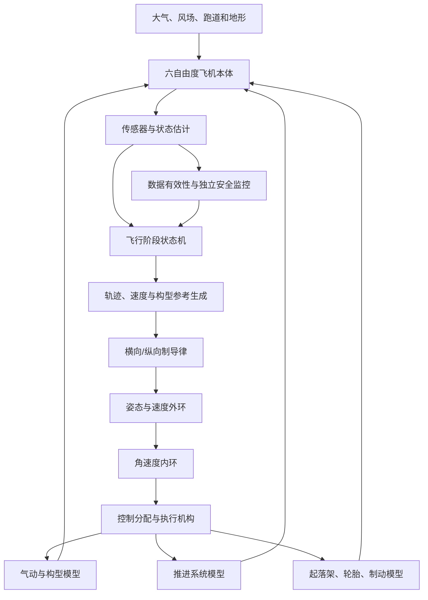
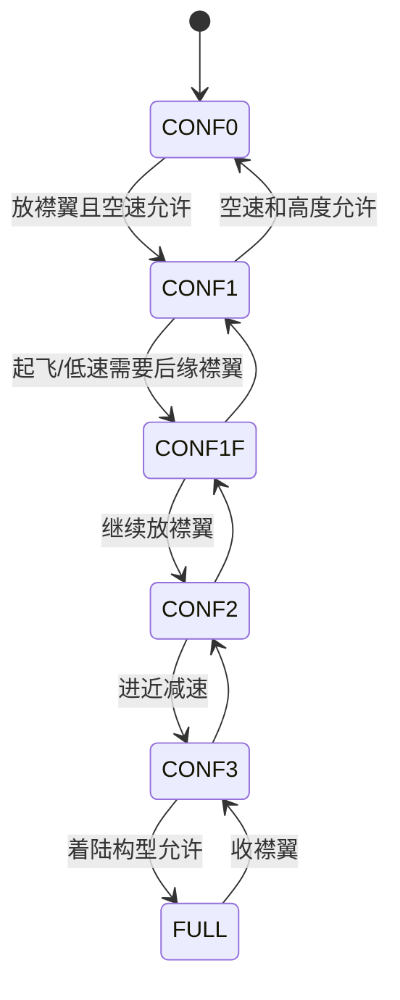
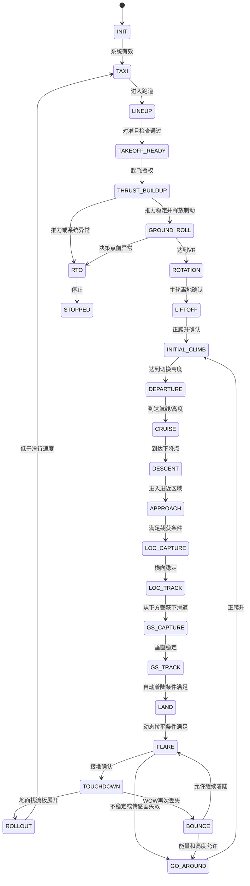

# 基于A320气动数据与制导控制架构的无人机自主起降巡航完整仿真方案

## 1. 文档目标

本文给出一套面向常规固定翼、前三点式起落架无人机的完整自主起飞、巡航、进近、着陆和滑跑仿真方案。

方案使用以下本地资料：

- `A320_气动参数提取表_SI.md`：几何、气动系数、构型增量、控制面限位和参考速度；
- A320 FMGC外环：RWY、RWY TRK、HPATH/NAV、SRS、LOC、GS、FLARE、ROLL OUT；
- A320 ELAC/SEC/BSCU思想：姿态与角速度内环、扰流板、前轮转向、制动和模式有效性管理；
- `flight_model.cfg`：起落架接地点、轮胎半径、收放时间等补充数据。

按用户要求，六自由度刚体运动方程不在本文展开。本文重点包括：

1. 可直接用于仿真的A320气动数据；
2. 起落架、轮胎、减震器、轮速、制动和防滑模型；
3. 襟翼、缝翼、扰流板和起落架收放气动模型；
4. 起飞、巡航、进近、拉平、接地和滑跑控制器；
5. 各阶段制导信号的生成方法；
6. 飞行状态机、模式切换、保护和复飞逻辑；
7. 参数设计、增益调度和仿真验证方法。

---

## 2. 使用边界与重要结论

### 2.1 仿真对象

本文默认的仿真对象是：

- 常规布局固定翼飞机；
- 副翼、升降舵、方向舵；
- 可调水平安定面或升降舵配平；
- 前轮转向；
- 左右主轮独立制动；
- 后缘襟翼、前缘缝翼；
- 对称空中减速板和地面扰流板；
- 可收放前三点式起落架；
- 推力可连续控制；
- 具备IMU、GNSS/INS、空速、高度、无线电高度或激光高度、轮速和起落架压缩信号。

### 2.2 A320数据能否直接用于无人机

如果仿真飞机的尺寸、质量、惯量和构型与A320相近，可以把本文提取的参数作为第一版模型。

如果目标是小型无人机：

- 可以参考A320的控制架构、状态机、制导方式和无扰切换；
- 可以将无量纲气动系数作为早期概念模型的起点；
- 不能直接使用A320的面积、翼展、质量、参考速度、起落架几何和控制增益；
- 必须用目标无人机的几何、质量、惯量、推力、舵机和试验数据重新缩放。

### 2.3 数据可信度分级

| 等级 | 含义 | 本文处理方式 |
|---|---|---|
| A | 从给定SI气动表直接提取 | 可直接装入查表模块，但仍需检查坐标和符号 |
| B | 从同一A320 `flight_model.cfg` 补充并换算 | 可作为A320尺度仿真初值 |
| C | 由A/B级数据计算得到 | 必须保留计算公式和源参数 |
| D | 资料中缺失、必须辨识或设计 | 不给出伪造数值，只给方法、范围和验收方式 |

### 2.4 必须避免的错误

1. 不要把MSFS的调参标量全部解释成标准无量纲稳定性导数。
2. 不要把A320的V2、VR、VAPP、拉平高度和自动刹车减速度直接用于其他无人机。
3. 不要只用一个`on_ground`布尔量处理离地和接地。
4. 不要在襟翼、起落架或扰流板构型变化时瞬间改变气动系数。
5. 不要让多个控制器同时直接控制同一个状态量而没有优先级和控制权限管理。
6. 不要把FMGC输出的姿态需求直接当成升降舵、副翼或方向舵偏角。

---

## 3. 总体仿真架构



### 3.1 推荐模块

| 模块 | 主要输入 | 主要输出 |
|---|---|---|
| Environment | 时间、位置、跑道 | 密度、风、阵风、地面法向、摩擦系数 |
| Aerodynamics | 状态、构型、舵面 | 气动力和气动力矩 |
| Propulsion | 油门、空速、高度 | 推力、推进力矩、燃油/电量 |
| LandingGear | 位姿、速度、轮速、制动 | 接触力、接触力矩、WOW、轮速 |
| HighLift | 构型指令、反馈、空速 | 襟翼/缝翼位置及气动增量 |
| Spoilers | 减速板/地面扰流指令 | 左右扰流板位置及气动增量 |
| StateEstimator | 传感器 | 位置、速度、姿态、风、偏差和有效性 |
| PhaseManager | 状态和任务 | 当前阶段、预位模式、活动模式 |
| Guidance | 跑道/航线/剖面 | 航迹、滚转、航迹角、垂直速度目标 |
| FlightControl | 制导目标、状态 | 力矩、舵面、油门、前轮和制动指令 |
| SafetyMonitor | 全部关键量 | 限制、降级、复飞、中止起飞 |

### 3.2 推荐运行频率

| 任务 | 推荐频率 |
|---|---:|
| 刚体积分、起落架接触、轮胎 | 500至1000 Hz |
| 舵机、轮速和防滑 | 200至500 Hz |
| 角速度内环 | 100至250 Hz |
| 姿态外环 | 50至100 Hz |
| 空速、能量和轨迹制导 | 20至50 Hz |
| 状态机与构型管理 | 20至50 Hz |
| 任务规划和性能计算 | 1至10 Hz |

起落架接触属于刚性、强非线性问题。若主仿真步长大于5 ms，应使用子步积分或隐式接触求解。

---

# 第一部分：可用于仿真的A320数据

## 4. 几何和参考量

以下均为A级数据，直接来自`A320_气动参数提取表_SI.md`。

| 参数 | 符号 | 数值 | SI单位 | 用途 |
|---|---:|---:|---:|---|
| 机翼面积 | \(S\) | 122.396968 | m² | 气动力参考面积 |
| 翼展 | \(b\) | 35.799979 | m | 滚转/偏航力矩参考长度 |
| 翼根弦长 | \(c_{root}\) | 6.065520 | m | 几何参考 |
| 机翼后掠角 | \(\Lambda\) | 0.436332 | rad | 气动和几何分析 |
| 机翼安装角 | \(i_w\) | 0.034907 | rad | 姿态与迎角关系 |
| 机翼扭转角 | \(\epsilon_w\) | -0.034907 | rad | 失速和升力分布 |
| 机翼上反角 | \(\Gamma\) | 0.089186 | rad | 横向稳定性 |
| 奥斯瓦尔德效率因子 | \(e\) | 0.700000 | 1 | 诱导阻力 |
| 水平尾翼面积 | \(S_h\) | 31.001744 | m² | 纵向控制 |
| 水平尾翼纵向位置 | \(x_h\) | -20.817840 | m | 尾翼力矩臂参考 |
| 水平尾翼垂向位置 | \(z_h\) | 2.743200 | m | 尾翼力矩臂参考 |
| 垂直尾翼面积 | \(S_v\) | 21.507054 | m² | 偏航稳定和方向舵 |
| 垂直尾翼纵向位置 | \(x_v\) | -19.812000 | m | 垂尾力矩臂参考 |
| 垂直尾翼垂向位置 | \(z_v\) | 5.943600 | m | 垂尾力矩臂参考 |
| 机身长度 | \(l_f\) | 37.572696 | m | 碰撞和几何参考 |
| 机身直径 | \(d_f\) | 3.962400 | m | 碰撞和侧面积参考 |

### 4.1 推导量

以下为C级数据：

\[
AR=\frac{b^2}{S}=10.471162
\]

\[
k_i=\frac{1}{\pi eAR}=0.04342674
\]

如果使用表中的`induced_drag_scalar=1.715`：

\[
k_{i,eff}=1.715k_i=0.07447685
\]

注意：

- \(S/b=3.418912\ \text{m}\)只能作为平均弦长的粗略几何代理；
- 真正的平均气动弦及其位置应由机翼平面形数据计算或单独提供；
- 俯仰力矩方程不应在缺少真实平均气动弦时使用该代理完成最终标定。

---

## 5. 操纵面限位

| 操纵面 | 数值 | SI单位 | 建模用途 |
|---|---:|---:|---|
| 升降舵最大上偏 | 0.436332 | rad | 位置饱和 |
| 升降舵最大下偏 | 0.296706 | rad | 位置饱和 |
| 副翼最大上偏 | 0.436332 | rad | 位置饱和 |
| 副翼最大下偏 | 0.436332 | rad | 位置饱和 |
| 方向舵最大偏角 | 0.436332 | rad | 位置饱和 |
| 安定面/升降舵配平抬头限位 | 0.235619 | rad | 配平限位 |
| 安定面/升降舵配平低头限位 | 0.069813 | rad | 配平限位 |
| 空中扰流板最大偏角 | 0.698132 | rad | 空中减速板限位 |
| 地面扰流板最大偏角 | 0.872665 | rad | 接地卸升限位 |
| 扰流板名义伸出时间 | 0.100000 | s | 执行机构初值 |

`elevator_maxangle_scalar=0.465`、`rudder_maxangle_scalar=0.97`属于飞行模型调参标量。建议：

- 第一版物理模型先使用明确的几何限位；
- 通过配平和操纵效能试验决定是否再引入最大角缩放；
- 不要同时缩放最大角和控制导数而造成重复降效。

---

## 6. 基础气动系数

| 参数 | 数值 | 用途 |
|---|---:|---|
| 零升阻力系数 | \(C_{D0}=0.01865\) | 光洁构型阻力 |
| 零阻力对应升力系数 | \(C_{L,D0}=0.175\) | 阻力极线中心 |
| 放襟翼零阻力对应升力系数 | \(C_{L,D0,f}=0.420\) | 放襟翼阻力极线中心 |
| 襟翼增升总系数 | \(\Delta C_{L,f}=1.867\) | 襟翼构型增量 |
| 襟翼增阻总系数 | \(\Delta C_{D,f}=0.1316\) | 襟翼构型增量 |
| 起落架增阻系数 | \(\Delta C_{D,g}=0.0372\) | 起落架放下增阻 |
| 扰流板升力增量 | \(\Delta C_{L,s}=-0.466875\) | 卸升 |
| 扰流板阻力增量 | \(\Delta C_{D,s}=0.05775\) | 减速 |
| 襟翼俯仰力矩增量 | \(\Delta C_{m,f}=-0.084\) | 构型俯仰变化 |
| 起落架俯仰力矩增量 | \(\Delta C_{m,g}=0.0022\) | 起落架构型变化 |
| 扰流板俯仰力矩增量 | \(\Delta C_{m,s}=0.023\) | 扰流板构型变化 |

推荐的光洁构型阻力模型为：

\[
C_D=
C_{D0}
+\Delta C_{D0}(M)
+k_{i,eff}(C_L-C_{L,D0})^2
+\Delta C_{D,config}
+\Delta C_{D,\beta}
+\Delta C_{D,control}
\]

其中：

\[
\Delta C_{D,config}
=
\Delta C_{D,f}
+\Delta C_{D,g}
+\Delta C_{D,s}
\]

不要只使用\(C_{D0}\)而遗漏诱导阻力，否则起飞距离、爬升率、进近推力和下滑性能都会失真。

---

## 7. 升力随迎角变化

该表是起飞、失速、进近和拉平阶段最重要的A级数据之一。

| 迎角 \(\alpha\)（rad） | \(C_L\) |
|---:|---:|
| -3.150 | 0.000 |
| 0.000 | 0.138 |
| 0.139 | 1.320 |
| 0.200 | 1.480 |
| 0.260 | 1.760 |
| 0.290 | 1.750 |
| 0.320 | 1.600 |
| 0.500 | 1.500 |
| 3.150 | 0.000 |

实现要求：

1. 正常飞行区间使用分段线性或单调三次插值；
2. 不得用高阶多项式跨越全迎角区间拟合；
3. 在\(\alpha=0.26\ \text{rad}\)附近得到表中最大\(C_L\)；
4. 失速后区间必须保持表中下降趋势；
5. 若仿真需要动态失速，应在静态表外增加迎角变化率、迟滞和分离状态，不能仅靠静态查表。

推荐：

\[
C_{L,base}
=
K_{GE}(h,b,M)
\cdot
K_{CL,cruise}
\cdot
\operatorname{Table}_{CL}(\alpha)
\]

其中`cruise_lift_scalar=0.93`可作为\(K_{CL,cruise}\)的初始值，但应通过配平一致性决定是否启用。

---

## 8. 俯仰力矩随迎角变化

| 迎角 \(\alpha\)（rad） | \(C_m\) |
|---:|---:|
| -3.150 | 0.000 |
| -0.800 | -2.402 |
| -0.400 | -1.861 |
| -0.200 | -0.842 |
| -0.100 | -0.442 |
| 0.000 | 0.000 |
| 0.200 | 1.173 |
| 0.230 | 1.337 |
| 0.260 | 1.489 |
| 0.290 | 1.723 |
| 0.310 | 1.919 |
| 0.400 | 2.276 |
| 0.800 | 2.992 |
| 3.150 | 0.000 |

该表的符号和稳定性趋势依赖MSFS坐标、力矩符号及内部附加稳定性模型。导入自建六自由度模型前必须执行：

1. 固定速度和重心；
2. 扫描小迎角区间；
3. 检查\(\partial M/\partial\alpha\)的实际稳定性符号；
4. 检查升降舵正偏定义；
5. 用配平点验证总俯仰力矩为零；
6. 必要时只保留表的非线性形状，重新标定斜率和零偏。

不能在未核对符号时直接把该表送入标准航空坐标系。

---

## 9. 升降舵效能随迎角变化

| 迎角 \(\alpha\)（rad） | 升降舵效能倍率 |
|---:|---:|
| -3.141593 | -1.000 |
| -0.698132 | 0.050 |
| -0.349066 | 0.455 |
| -0.174533 | 0.853 |
| -0.087266 | 1.007 |
| 0.000000 | 1.000 |
| 0.087266 | 0.839 |
| 0.174533 | 0.693 |
| 0.349066 | 0.381 |
| 0.698132 | -0.080 |
| 3.141593 | -1.000 |

俯仰控制项可写成：

\[
C_{m,\delta_e}
=
C_{m_{\delta_e},0}
K_{\delta_e}(\alpha)
\delta_e
\]

其中：

\[
C_{m_{\delta_e},0}=-11.78
\]

但`-11.78`在源配置中属于模拟器气动导数。自建模型必须通过小扰动试验确认：

- 角度单位是rad还是模拟器内部归一化量；
- 力矩参考长度；
- 是否已被`elevator_effectiveness`和`elevator_maxangle_scalar`重复缩放。

---

## 10. 横侧向与动态导数

| 导数/系数 | 数值 | 初始用途 |
|---|---:|---|
| \(C_{Y_\beta}\)代理 | -3.252 | 侧滑侧力 |
| \(C_{Y_p}\)代理 | 1.833 | 滚转率侧力 |
| \(C_{Y_r}\)代理 | 17.395 | 偏航率侧力 |
| \(C_{Y_{\delta_r}}\)代理 | -2.793 | 方向舵侧力 |
| \(C_{l_\beta}\)代理 | 0.554 | 上反效应 |
| \(C_{l_p}\)代理 | -2.078 | 滚转阻尼 |
| \(C_{l_r}\)代理 | -2.621 | 偏航率滚转耦合 |
| \(C_{l_{\delta_a}}\)代理 | -0.291 | 副翼滚转效能 |
| \(C_{l_{\delta_r}}\)代理 | 0.476 | 方向舵滚转耦合 |
| \(C_{n_\beta}\)代理 | 1.296 | 风标稳定 |
| \(C_{n_p}\)代理 | 0.742 | 滚转率偏航耦合 |
| \(C_{n_r}\)代理 | -67.303 | 偏航阻尼 |
| \(C_{n_{\delta_a}}\)代理 | -0.007 | 副翼不利偏航 |
| \(C_{n_{\delta_r}}\)代理 | 1.321 | 方向舵偏航效能 |
| \(C_{L_q}\)代理 | -57.116 | 俯仰率升力影响 |
| \(C_{L_{\delta_e}}\)代理 | -1.652 | 升降舵升力影响 |
| \(C_{m_q}\)代理 | -1245.917 | 俯仰阻尼 |

这些值只能作为“模拟器导数代理”。推荐的标准无量纲角速度为：

\[
\hat p=\frac{pb}{2V_a},\qquad
\hat q=\frac{q\bar c}{2V_a},\qquad
\hat r=\frac{rb}{2V_a}
\]

标准系数模型为：

\[
C_l=C_{l_\beta}\beta+C_{l_p}\hat p+C_{l_r}\hat r+
C_{l_{\delta_a}}\delta_a+C_{l_{\delta_r}}\delta_r
\]

\[
C_n=C_{n_\beta}\beta+C_{n_p}\hat p+C_{n_r}\hat r+
C_{n_{\delta_a}}\delta_a+C_{n_{\delta_r}}\delta_r
\]

在没有确认源配置归一化方式之前，应给每个代理导数增加可标定缩放量：

\[
C_{x}=s_x C_{x,source}
\]

初始标定目标包括：

- 荷兰滚阻尼和频率；
- 滚转时间常数；
- 方向舵阶跃响应；
- 升降舵阶跃和短周期响应；
- 配平舵偏；
- 稳态转弯侧滑。

---

## 11. 地面效应和马赫数修正

### 11.1 地效升力倍率

| Mach | 地效升力倍率 |
|---:|---:|
| 0.00 | 1.1780 |
| 0.15 | 1.1780 |
| 0.19 | 1.1780 |
| 0.20 | 1.1760 |
| 0.22 | 1.1730 |
| 0.25 | 1.1700 |
| 0.27 | 1.1675 |
| 0.30 | 1.1640 |
| 0.35 | 1.1590 |
| 1.00 | 1.0000 |

原表只随Mach变化，没有显式高度变量。自建仿真应增加高度衰减：

\[
K_{GE}(h)=
1+\left(K_{GE,table}(M)-1\right)
\exp\left[-k_{GE}\frac{h_w}{b}\right]
\]

其中\(h_w\)为机翼参考点离地高度，\(k_{GE}\)为D级待标定参数。

### 11.2 零升阻力马赫修正

| Mach | \(\Delta C_{D0}\) |
|---:|---:|
| 0.00 | 0.0000 |
| 0.50 | 0.0000 |
| 0.55 | 0.0000 |
| 0.60 | 0.0002 |
| 0.65 | 0.0003 |
| 0.70 | 0.0004 |
| 0.75 | 0.0008 |
| 0.80 | 0.0015 |
| 0.85 | 0.0100 |
| 0.90 | 0.1500 |
| 0.95 | 0.3330 |
| 1.00 | 0.5000 |

自主起降阶段通常处于低Mach区，但该表对巡航和高速下降仍然必要。

---

## 12. 参考速度

| 参数 | 数值（m/s） | 用法 |
|---|---:|---|
| 全襟翼失速速度 | 59.161111 | A320尺度着陆性能一致性检查 |
| 光洁构型失速速度 | 87.970000 | A320尺度光洁失速检查 |
| 最小抬轮速度 | 61.733333 | A320尺度VR下界参考 |
| 配置文件起飞速度 | 59.161111 | 仅作源模型参考 |
| 爬升速度 | 118.836667 | 巡航爬升参考 |
| 巡航速度 | 234.072222 | 巡航目标参考 |
| 最大放襟翼速度 | 140.973276 | 总构型保护上限 |
| 最大放起落架速度 | 144.044444 | 起落架保护上限 |
| 正常运行速度 | 180.055556 | 运行限制参考 |
| 最大指示空速 | 257.222222 | 超速保护参考 |

无人机控制器不得直接把这些速度写死。应按当前质量、密度和构型计算：

\[
V_s=
\sqrt{\frac{2W}{\rho S C_{L,max}}}
\]

\[
V_{ref}=K_{ref}V_s,\qquad
V_R=K_RV_s,\qquad
V_{climb}=K_{climb}V_s
\]

其中\(K_{ref}\)、\(K_R\)、\(K_{climb}\)必须由性能分析和试飞确定。

---

## 13. 襟翼与缝翼档位

### 13.1 主要气动后缘襟翼组FLAPS.1

| 构型 | 偏角（rad） | 速度限制（m/s） | 阻力比例 \(g_D\) | 升力比例 \(g_L\) |
|---|---:|---:|---:|---:|
| CONF 0 | 0.000000 | 未设置 | 0.000 | 0.000 |
| CONF 1 | 0.087266 | 未设置 | 0.300 | 0.010 |
| CONF 1+F | 0.174533 | 110.605556 | 0.630 | 1.300 |
| CONF 2 | 0.261799 | 102.888889 | 0.850 | 1.300 |
| CONF 3 | 0.349066 | 95.172222 | 0.970 | 1.170 |
| CONF FULL | 0.698132 | 91.056667 | 0.939 | 1.000 |

### 13.2 前缘缝翼组FLAPS.2

| 构型 | 偏角（rad） | 速度限制（m/s） | 阻力比例 \(g_{D,s}\) | 升力比例 \(g_{L,s}\) |
|---|---:|---:|---:|---:|
| CONF 0 | 0.000000 | 未设置 | 1.000 | 1.000 |
| CONF 1 | 0.314159 | 118.322222 | 0.330 | 1.000 |
| CONF 1+F | 0.314334 | 118.322222 | 0.630 | 1.000 |
| CONF 2 | 0.383972 | 102.888889 | 0.850 | 1.000 |
| CONF 3 | 0.384147 | 95.172222 | 0.970 | 1.000 |
| CONF FULL | 0.471239 | 91.056667 | 0.939 | 1.000 |

### 13.3 FLAPS.0的处理

FLAPS.0虽然也有后缘襟翼偏角表，但其：

- `lift_scalar=0`；
- `drag_scalar=0`；
- `pitch_scalar=0`。

因此在自建气动模型中，不应把FLAPS.0再次加入气动增量，否则会重复计算。它可保留为：

- 几何/动画通道；
- 兼容原模型的构型索引；
- 故障或分段襟翼显示通道。

---

## 14. 起落架补充几何

以下为B级数据，来自相同飞机目录的`flight_model.cfg`，不是给定气动表中的字段。

### 14.1 基本量

| 参数 | 数值 | SI单位 |
|---|---:|---:|
| 静止地面俯仰角 | -0.003491 | rad |
| 静止时重心离地高度 | 2.709672 | m |
| 空机质量 | 42500.244 | kg |
| 最大起飞质量 | 78999.915 | kg |

源配置还给出以下空机惯量代理：

| 源字段 | SI数值 | SI单位 | 使用限制 |
|---|---:|---:|---|
| `empty_weight_pitch_MOI` | 3326789.481 | kg·m² | 按源字段称为俯仰惯量，不直接映射标准轴 |
| `empty_weight_roll_MOI` | 1340910.730 | kg·m² | 按源字段称为滚转惯量，不直接映射标准轴 |
| `empty_weight_yaw_MOI` | 4292706.727 | kg·m² | 按源字段称为偏航惯量，不直接映射标准轴 |
| `empty_weight_coupled_MOI` | 1355.818 | kg·m² | 耦合惯量代理 |

源配置对纵向、横向、垂向坐标和惯量轴的命名与常见航空机体系不完全一致。导入六自由度模型前必须通过轴定义和转动响应检查完成映射。

### 14.2 三个轮式接地点

以下位置是相对源配置参考基准的坐标。导入自建模型时必须转换到统一机体系。

| 接地点 | 纵向位置（m） | 横向位置（m） | 垂向位置（m） | 轮胎半径（m） | 最大转向角（rad） |
|---|---:|---:|---:|---:|---:|
| 前轮 | 8.363712 | 0.000000 | -2.910840 | 0.381000 | 1.658063 |
| 左主轮 | -4.276344 | -4.267200 | -2.996184 | 0.584208 | 0.000000 |
| 右主轮 | -4.276344 | 4.267200 | -2.996184 | 0.584208 | 0.000000 |

推导几何：

| 推导量 | 数值 |
|---|---:|
| 前轮至主轮轴线距离 | 12.640056 m |
| 左右主轮轮距 | 8.534400 m |
| 空机重心源配置纵向位置 | -2.871216 m |
| 前轮相对空机重心纵向距离 | 11.234928 m |
| 主轮相对空机重心纵向距离 | -1.405128 m |

源配置还给出：

| 参数 | 前轮 | 主轮 |
|---|---:|---:|
| 名义压缩参数 | 0.3048 m | 0.376428 m |
| 最大压缩推导值 | 0.573024 m | 0.523235 m |
| 阻尼常数代理 | 1.05 | 0.45 |
| 伸出时间 | 10.6 s | 11.1 s |
| 收起时间 | 9.4 s | 9.9 s |
| 弹簧指数代理 | 2.05 | 1.05 |

这些压缩和阻尼量属于模拟器接触模型参数，不应直接视为N/m和N·s/m。物理减震器应按第19节重新建立。

### 14.3 总气动系数组装

建议先在统一的风轴/机体系约定下组装无量纲系数，再由六自由度本体转换为力和力矩。

升力：

\[
C_L=
K_{GE}
\left[
K_{CL,cruise}\operatorname{Table}_{CL}(\alpha)
+s_{L_q}C_{L_q}\hat q
+s_{L_{\delta_e}}C_{L_{\delta_e}}\delta_e
\right]
+\Delta C_{L,flap}
+\Delta C_{L,sp}
\]

阻力：

\[
C_D=
C_{D0}
+\Delta C_{D0}(M)
+k_{i,eff}(C_L-C_{L,D0,config})^2
+\Delta C_{D,flap}
+\Delta C_{D,gear}
+\Delta C_{D,sp}
+\Delta C_{D,control}
\]

俯仰力矩：

\[
C_m=
s_{m_\alpha}\operatorname{Table}_{Cm}(\alpha)
+s_{m_q}C_{m_q}\hat q
+s_{m_{\delta_e}}C_{m_{\delta_e}}
K_{\delta_e}(\alpha)\delta_e
+\Delta C_{m,flap}
+\Delta C_{m,gear}
+\Delta C_{m,sp}
+C_{m0,trim}
\]

侧力：

\[
C_Y=
s_{Y_\beta}C_{Y_\beta}\beta
+s_{Y_p}C_{Y_p}\hat p
+s_{Y_r}C_{Y_r}\hat r
+s_{Y_{\delta_r}}C_{Y_{\delta_r}}\delta_r
\]

滚转力矩：

\[
C_l=
s_{l_\beta}C_{l_\beta}\beta
+s_{l_p}C_{l_p}\hat p
+s_{l_r}C_{l_r}\hat r
+s_{l_{\delta_a}}C_{l_{\delta_a}}\delta_a
+s_{l_{\delta_r}}C_{l_{\delta_r}}\delta_r
+\Delta C_{l,asym}
\]

偏航力矩：

\[
C_n=
s_{n_\beta}C_{n_\beta}\beta
+s_{n_p}C_{n_p}\hat p
+s_{n_r}C_{n_r}\hat r
+s_{n_{\delta_a}}C_{n_{\delta_a}}\delta_a
+s_{n_{\delta_r}}C_{n_{\delta_r}}\delta_r
+\Delta C_{n,asym}
\]

其中全部\(s_*\)都是源模拟器导数到标准自建模型的标定缩放量。初始阶段不得默认全部等于1并直接用于实飞结论。

---

# 第二部分：构型与执行机构模型

## 15. 通用执行机构模型

所有舵面、襟翼、扰流板、前轮和起落架收放位置都应使用“指令”和“实际位置”两套状态。

推荐模型：

\[
\dot\delta=
\operatorname{sat}_{-\dot\delta_{max}}^{\dot\delta_{max}}
\left[
\frac{\delta_c-\delta}{\tau_a}
\right]
\]

\[
\delta=
\operatorname{sat}_{\delta_{min}}^{\delta_{max}}(\delta)
\]

可选非线性：

- 纯延迟；
- 死区；
- 回差；
- 速率随液压压力或电压变化；
- 左右不同步；
- 卡死；
- 漂移；
- 指令反向；
- 传感器偏置；
- 位置反馈丢失。

### 15.1 每个执行机构必须输出

| 输出 | 用途 |
|---|---|
| 实际位置 | 气动和接触模型 |
| 实际速率 | 监控和载荷计算 |
| 到位状态 | 状态机转换 |
| 饱和状态 | 抗积分饱和 |
| 故障状态 | 控制重构 |
| 指令与反馈偏差 | 卡滞检测 |

---

## 16. 襟翼与缝翼模型

### 16.1 构型状态机



每次转换必须满足：

- 当前空速低于目标构型允许速度并留有裕度；
- 左右襟翼反馈有效；
- 无明显不对称；
- 执行机构未卡滞；
- 当前飞行阶段允许；
- 不处于禁止构型变化的拉平/接地瞬态。

### 16.2 连续运动

源配置给出后缘襟翼伸出时间20 s、前缘缝翼伸出时间20 s。可用作第一版全行程时间：

\[
\dot\delta_{f,max}
\approx
\frac{\delta_{f,max}-\delta_{f,min}}{20}
\]

第一版模型可使用：

\[
\delta_f(t+\Delta t)=
\delta_f(t)+
\operatorname{sat}
\left(
\delta_{f,c}-\delta_f,
\dot\delta_{f,max}\Delta t
\right)
\]

更高保真模型应包含：

- 起动延迟；
- 压力建立；
- 接近目标位置减速；
- 左右通道独立；
- 位置同步误差；
- 空速吹脱；
- 超速损坏或自动抑制。

### 16.3 襟翼气动增量

对每个相邻构型，按实际襟翼偏角进行线性插值，得到：

\[
g_{L,TE}(\delta_f),\qquad
g_{D,TE}(\delta_f)
\]

前缘缝翼得到：

\[
g_{L,LE}(\delta_s),\qquad
g_{D,LE}(\delta_s)
\]

基于源配置标量，建议的第一版组合为：

\[
\Delta C_{L,flap}
=
1.867
\left[
g_{L,TE}
+0.01g_{L,LE}
\right]
\]

\[
\Delta C_{D,flap}
=
0.1316
\left[
g_{D,TE}
+0.5g_{D,LE}
\right]
\]

\[
\Delta C_{m,flap}
=
-0.084
\left[
g_{m,TE}
+g_{m,LE}
\right]
\]

其中\(g_m\)在源SI表中没有独立构型列。第一版可用实际偏角归一化：

\[
g_{m,TE}=\frac{\delta_f}{\delta_{f,max}},\qquad
g_{m,LE}=\frac{\delta_s}{\delta_{s,max}}
\]

随后必须通过各构型配平数据重新标定。

### 16.4 构型改变对失速的影响

仅增加\(\Delta C_L\)不足以得到可信的低速特性。每个构型应有：

- \(C_{L,max}(config)\)；
- \(\alpha_{stall}(config)\)；
- 失速后下降斜率；
- 升降舵效能；
- 俯仰力矩曲线；
- 阻力极线中心；
- 地效修正。

若缺少风洞数据，可用给定全襟翼失速速度反推全襟翼有效\(C_{L,max}\)，但必须使用明确的质量和密度：

\[
C_{L,max,full}
=
\frac{2W}{\rho S V_{s,full}^2}
\]

### 16.5 襟翼不对称

左右襟翼分别建模：

\[
\delta_{f,L},\qquad \delta_{f,R}
\]

平均偏角影响升阻力：

\[
\bar\delta_f=\frac{\delta_{f,L}+\delta_{f,R}}{2}
\]

差动偏角产生滚转和偏航扰动：

\[
\Delta\delta_f=\delta_{f,L}-\delta_{f,R}
\]

\[
\Delta C_l=K_{lf}\Delta\delta_f,\qquad
\Delta C_n=K_{nf}\Delta\delta_f
\]

\(K_{lf}\)和\(K_{nf}\)为D级参数。超过允许差值或持续时间后：

- 停止襟翼继续运动；
- 锁定现有构型；
- 限制滚转和空速；
- 进近阶段触发复飞或重新规划着陆速度。

---

## 17. 扰流板模型

### 17.1 功能分解

扰流板应拆分为三个逻辑功能：

| 功能 | 左右关系 | 主要作用 |
|---|---|---|
| 空中减速板 | 对称 | 增阻、减升 |
| 扰流副翼 | 差动 | 辅助滚转 |
| 地面扰流板 | 对称快速展开 | 卸升、增加轮载和制动能力 |

给定数据中`spoilerons_available=0`，因此复现源模型时不启用扰流副翼。无人机若需要差动扰流板，可以作为扩展功能重新辨识。

给定数据中的`auto_spoiler_available=0`表示关闭MSFS内置自动扰流板功能，不表示A320系统没有地面扰流板。该项目由外部SEC逻辑计算并驱动扰流板，因此自建仿真应实现独立地面扰流板状态机。

### 17.2 实际偏角分解

\[
\delta_{sp,L}
=
\operatorname{sat}
\left(
\delta_{sym}+\delta_{diff}
\right)
\]

\[
\delta_{sp,R}
=
\operatorname{sat}
\left(
\delta_{sym}-\delta_{diff}
\right)
\]

对称量：

\[
\eta_{sym}
=
\frac{\delta_{sp,L}+\delta_{sp,R}}
{2\delta_{sp,max}}
\]

差动量：

\[
\eta_{diff}
=
\frac{\delta_{sp,L}-\delta_{sp,R}}
{2\delta_{sp,max}}
\]

### 17.3 对称气动增量

\[
\Delta C_{L,sp}
=
-0.466875\,\eta_{sym}
\]

\[
\Delta C_{D,sp}
=
0.05775\,\eta_{sym}
\]

\[
\Delta C_{m,sp}
=
0.023\,\eta_{sym}
\]

第一版使用线性比例。高保真模型应使用偏角、Mach、迎角和构型的多维查表。

### 17.4 差动扰流板

如果启用扰流副翼：

\[
\Delta C_l=C_{l_{\delta sp}}\eta_{diff}
\]

\[
\Delta C_n=C_{n_{\delta sp}}\eta_{diff}
\]

这两个导数在给定资料中缺失，必须通过CFD、风洞或飞行辨识获得。

### 17.5 地面扰流板展开逻辑

推荐预位条件：

- 着陆构型成立；
- 起落架放下锁定；
- 地面扰流板功能可用；
- 处于APPROACH、FLARE或LANDING阶段；
- 推力命令允许接地后收至慢车。

推荐完全展开条件：

1. 左右主轮WOW成立并确认；
2. 至少一个主轮轮速超过可信门限；
3. 油门低于接地门限；
4. 非复飞状态；
5. 条件持续指定确认时间。

部分卸升可在以下情况下使用：

- 单主轮先接地；
- 轮速已建立但双主轮WOW尚未同时成立；
- 需要避免瞬时全展开造成再弹跳。

撤回条件：

- 复飞油门；
- WOW丢失且无线电高度重新上升；
- 弹跳检测；
- 地面扰流板故障；
- 起飞滑跑误触发保护。

### 17.6 与自动刹车联锁

参考A320架构，自动刹车不应仅由WOW触发，而应由地面扰流板实际展开确认触发。这样可以确保：

- 飞机已经完成接地逻辑确认；
- 卸升后主轮法向载荷足够；
- 制动控制不在空中或弹跳阶段误接通。

---

## 18. 起落架收放与气动模型

每个起落架至少包含：

- 指令状态；
- 实际收放位置\(\eta_g\in[0,1]\)；
- 舱门位置；
- 上锁和下锁状态；
- 收放超时；
- 左右不一致；
- 接地点启用状态。

其中：

- \(\eta_g=0\)：完全收起；
- \(\eta_g=1\)：完全放下。

起落架气动增量：

\[
\Delta C_{D,g}=0.0372\,g_D(\eta_g,\eta_{door})
\]

\[
\Delta C_{m,g}=0.0022\,g_m(\eta_g,\eta_{door})
\]

第一版可取：

\[
g_D=\eta_g,\qquad g_m=\eta_g
\]

更高保真模型应在舱门打开时增加瞬态阻力峰值。

收放时间可采用前轮和主轮的独立值：

| 动作 | 前轮 | 主轮 |
|---|---:|---:|
| 伸出 | 10.6 s | 11.1 s |
| 收起 | 9.4 s | 9.9 s |

起落架接触点只在以下条件全部满足时启用：

- 实际位置超过接触启用阈值；
- 下锁成立或位置足够接近放下；
- 对应起落架结构未失效。

---

# 第三部分：起落架、轮胎和制动模型

## 19. 接地点运动学

对第\(i\)个轮胎接地点：

\[
\mathbf r_i^n=
\mathbf r_{CG}^n+
\mathbf C_b^n\mathbf r_i^b
\]

接地点速度：

\[
\mathbf v_i^n=
\mathbf v_{CG}^n+
\mathbf C_b^n
\left(
\boldsymbol\omega^b\times\mathbf r_i^b
\right)
\]

将速度投影到跑道局部坐标：

- \(x_r\)：沿跑道；
- \(y_r\)：跑道右侧；
- \(z_r\)：跑道法向向上。

必须使用接地点速度而不是重心速度计算轮胎滑移。

---

## 20. 跑道与接触判定

跑道局部平面：

\[
\mathbf n_r^T(\mathbf p-\mathbf p_0)=0
\]

轮胎最低点距离：

\[
d_i=
\mathbf n_r^T(\mathbf r_i-\mathbf p_0)-R_i
\]

压缩量：

\[
x_i=\max(0,-d_i)
\]

压缩速度：

\[
\dot x_i=
\begin{cases}
-\mathbf n_r^T\mathbf v_i,&x_i>0\\
\max(0,-\mathbf n_r^T\mathbf v_i),&x_i=0
\end{cases}
\]

接触激活应带微小滞回，避免轮胎在零压缩附近高速开关。接触建立后必须允许\(\dot x_i<0\)，否则无法表示减震器回弹阻尼。

---

## 21. 油气减震器与轮胎垂向力

推荐非线性弹簧阻尼模型：

\[
F_{z,i}
=
\max
\left[
0,
k_i x_i^{n_i}
+c_i(x_i)\dot x_i
+F_{pre,i}
\right]
\]

其中：

- \(k_i\)：等效刚度；
- \(n_i\)：弹簧非线性指数；
- \(c_i\)：压缩/回弹阻尼；
- \(F_{pre,i}\)：预充或预载。

可区分压缩和回弹：

\[
c_i=
\begin{cases}
c_{comp,i},&\dot x_i>0\\
c_{reb,i},&\dot x_i\le0
\end{cases}
\]

### 21.1 参数设计

先由静态轮载确定刚度。

设静态压缩为\(x_{s,i}\)，静态轮载为\(F_{s,i}\)：

\[
k_i=
\frac{F_{s,i}-F_{pre,i}}{x_{s,i}^{n_i}}
\]

线化等效刚度：

\[
k_{eq,i}=n_i k_i x_{s,i}^{n_i-1}
\]

目标阻尼比\(\zeta_i\)对应：

\[
c_i=2\zeta_i\sqrt{k_{eq,i}m_{eq,i}}
\]

其中\(m_{eq,i}\)不是整机质量简单均分，应由起落架几何和静态载荷分配计算。

### 21.2 静态载荷分配

对纵向三点支撑：

\[
F_N+F_{ML}+F_{MR}=W
\]

\[
F_N l_N=(F_{ML}+F_{MR})l_M
\]

左右对称时：

\[
F_{ML}=F_{MR}
\]

必须针对前重心、后重心和不同质量重新计算。

### 21.3 数值处理

- 设置最大允许压缩和硬限位；
- 硬限位使用连续高刚度段，不使用无限刚度；
- 接触力由小到大连续建立；
- 对垂向速度进行带宽受控滤波；
- 采用子步积分；
- 监测接触能量和数值能量增长。

---

## 22. 轮胎纵向模型

轮胎接地点沿轮平面的纵向速度为\(V_{x,i}\)，轮速为\(\omega_i\)，半径为\(R_i\)。

制动滑移率：

\[
\kappa_i=
\frac{R_i\omega_i-V_{x,i}}
{\max(|V_{x,i}|,V_\epsilon)}
\]

第一版平滑轮胎模型：

\[
F_{x,i}
=
\mu_{x,i}F_{z,i}
\tanh(C_{\kappa}\kappa_i)
\]

制动时应保证力方向与接地点相对运动相反。

更高保真模型可使用：

- Pacejka Magic Formula；
- Burckhardt摩擦模型；
- 试验得到的\(\mu-\kappa\)二维表；
- 干、湿、积水、冰雪跑道参数集。

---

## 23. 轮胎侧向模型

轮胎侧偏角：

\[
\alpha_{t,i}
=
\arctan2(V_{y,i},|V_{x,i}|+V_\epsilon)
-\delta_{steer,i}
\]

线性区：

\[
F_{y,i}=-C_{\alpha,i}\alpha_{t,i}
\]

饱和：

\[
F_{y,i}
=
\operatorname{sat}
\left(
-C_{\alpha,i}\alpha_{t,i},
\mu_{y,i}F_{z,i}
\right)
\]

### 23.1 联合滑移

制动和转向共享摩擦：

\[
\left(
\frac{F_{x,i}}{\mu_xF_{z,i}}
\right)^2+
\left(
\frac{F_{y,i}}{\mu_yF_{z,i}}
\right)^2
\le1
\]

没有摩擦圆/椭圆时，模型会在大制动下仍提供不现实的完整侧向力。

---

## 24. 车轮旋转动力学

\[
J_{w,i}\dot\omega_i
=
-R_iF_{x,i}
-T_{b,i}\operatorname{sgn}(\omega_i)
-T_{rr,i}\operatorname{sgn}(\omega_i)
\]

其中：

- \(J_w\)：车轮转动惯量；
- \(T_b\)：制动力矩；
- \(T_{rr}\)：轴承和滚阻力矩。

轮胎滚阻：

\[
F_{rr,i}=C_{rr}F_{z,i}\operatorname{sgn}(V_{x,i})
\]

车轮离地后可使用轴承阻尼使轮速缓慢衰减，而不是瞬间归零。

---

## 25. 制动执行机构

制动指令\(u_b\in[0,1]\)经过压力或电动作动器：

\[
\dot P_b=
\operatorname{sat}
\left(
\frac{P_{b,c}-P_b}{\tau_b}
\right)
\]

\[
T_b=K_bP_b
\]

电刹车可直接使用：

\[
\dot T_b=
\operatorname{sat}
\left(
\frac{T_{b,c}-T_b}{\tau_b}
\right)
\]

需要建模：

- 压力/力矩建立时间；
- 最大制动力矩；
- 左右差异；
- 温度衰减；
- 能量上限；
- 故障泄压；
- 停车制动；
- 指令速率限制。

---

## 26. 防滑控制

防滑目标是将滑移率保持在峰值摩擦附近：

\[
e_\kappa=\kappa_{ref}-\kappa
\]

\[
T_{b,c}
=
\operatorname{sat}
\left[
T_{base}
+K_{P,\kappa}e_\kappa
+K_{I,\kappa}\int e_\kappa dt
\right]
\]

推荐增加：

- 车轮减速度超限快速泄压；
- 轮速恢复后缓慢加压；
- 低速退出；
- 左右轮参考速度估计；
- 轮速传感器故障检测；
- 跑道摩擦在线估计；
- 弹跳时清除或冻结制动积分。

### 26.1 参考速度估计

不能把最慢轮作为地速参考。可用：

\[
V_{ref,wheel}
=
\max(R\omega_L,R\omega_R,V_{GNSS,along})
\]

并进行合理性投票和滤波。

---

## 27. 自动刹车

自动刹车应控制纵向减速度而不是直接给固定制动压力：

\[
e_a=a_{x,c}-a_x
\]

\[
u_{AB}
=
\operatorname{sat}
\left[
K_{P,a}e_a+
K_{I,a}\int e_a dt
\right]
\]

参考A320开源模型的架构：

- 加速度低通时间常数为0.1 s；
- PI控制器生成制动需求；
- LOW/MED使用随时间变化的减速度轨迹；
- MAX使用更高固定减速度目标；
- 地面扰流板实际展开后才接通。

A320模型中的示例目标为：

| 模式 | 源模型目标 |
|---|---|
| LOW | 延迟后渐变至约\(-2\ \text{m/s}^2\) |
| MED | 延迟后渐变至约\(-3\ \text{m/s}^2\) |
| MAX | 约\(-6\ \text{m/s}^2\) |

这些值只能作为A320仿真参考。无人机应根据：

- 起落架载荷；
- 轮胎摩擦；
- 跑道长度；
- 结构限制；
- 机载设备减速度限制；
- 防滑能力；
- 刹车热容量；

重新确定目标。

---

## 28. 前轮转向

前轮实际转角：

\[
\dot\delta_{NW}
=
\operatorname{sat}
\left(
\frac{\delta_{NW,c}-\delta_{NW}}{\tau_{NW}},
\dot\delta_{NW,max}
\right)
\]

转向权限随地速降低：

\[
\delta_{NW,max}(V_G)
=
\operatorname{Table}(V_G)
\]

推荐分配思想：

- 很低速：前轮主控；
- 中速：前轮与方向舵混合；
- 高速：方向舵主控，前轮只保留小角度；
- 低速大转弯：可加入差动制动；
- 前轮未压缩：转向指令为零。

A320源码中自动驾驶前轮需求只提供小角度，踏板和自动驾驶组合约限制在±6°量级；大角度滑行由手轮通道完成。无人机自主起降可采用同样的“高速小角度、低速大角度”原则，但速度断点按无人机重设。

---

## 29. 重量在轮上与接地检测

### 29.1 单轮WOW

第\(i\)个轮的WOW应由压缩量和法向力双条件形成：

\[
WOW_i=
(x_i>x_{on})
\land
(F_{z,i}>F_{on})
\]

退出使用较低门限：

\[
\neg WOW_i=
(x_i<x_{off})
\lor
(F_{z,i}<F_{off})
\]

### 29.2 可靠接地

可靠接地不应由单一WOW决定：

\[
TouchdownConfirmed=
MainWOW
\land WheelSpinup
\land h_{RA}<h_{TD}
\land T<T_{TD}
\]

并经过时间确认。

### 29.3 弹跳检测

接地后短时间内出现：

- 双主轮WOW丢失；
- 无线电高度重新增加；
- 垂直速度再次变负；
- 俯仰姿态和空速仍处于飞行区间；

则进入BOUNCE状态：

- 暂停自动刹车；
- 地面扰流板按验证策略部分或全部收回；
- 恢复飞行姿态控制；
- 根据高度、能量和跑道余量决定继续着陆或复飞。

---

# 第四部分：环境、传感器与推进模型

## 30. 跑道模型

每条跑道至少包含：

| 参数 | 用途 |
|---|---|
| 入口点和出口点 | 建立跑道坐标 |
| 真航向 | RWY、LOC和ROLL OUT参考 |
| 标高和坡度 | 下滑道和接触 |
| 长度、宽度 | 中止起飞和滑跑边界 |
| 摩擦系数 | 轮胎与制动 |
| 表面粗糙度 | 起落架激励 |
| 局部起伏 | 接触与载荷 |
| 磁差 | 磁航向显示兼容 |

跑道局部坐标：

\[
e_x=\frac{\mathbf p_{end}-\mathbf p_{thr}}
{\|\mathbf p_{end}-\mathbf p_{thr}\|}
\]

\[
e_y=e_z\times e_x
\]

横向偏差：

\[
e_{rwy,y}=(\mathbf p-\mathbf p_{center})^Te_y
\]

沿跑道距离：

\[
s_{rwy}=(\mathbf p-\mathbf p_{thr})^Te_x
\]

---

## 31. 风场

至少包含：

- 稳态顺逆风；
- 稳态侧风；
- 高度风切变；
- Dryden或Von Karman阵风；
- 跑道近地湍流；
- 阵风突变；
- 风向和风速传感误差。

导航和制导应明确区分：

- 机头航向\(\psi\)；
- 地面航迹\(\chi\)；
- 空速向量；
- 地速向量；
- 风估计。

---

## 32. 传感器模型

| 传感器 | 必要误差 |
|---|---|
| IMU | 偏置、随机游走、比例误差、安装误差、延迟 |
| GNSS | 白噪声、延迟、丢星、跳变、完整性 |
| 空速 | 偏置、堵塞、迎角/侧滑误差、低速失真 |
| 气压高度 | 偏置、天气变化、延迟 |
| 无线电/激光高度 | 地形、波束、异常值、近地噪声 |
| 轮速 | 量化、打滑、丢失、左右不一致 |
| 起落架压缩 | 门限、回差、卡滞 |
| 舵面位置 | 偏置、延迟、卡死 |

自动着陆至少应输出：

- 横向位置与完整性；
- 跑道横偏；
- 沿跑道距离；
- 跑道航迹角误差；
- 距跑道入口距离；
- 相对下滑路径高度误差；
- 近地高度和下沉率；
- 轮速和WOW；
- 所有量的有效性标志。

---

## 33. 推进系统模型

起飞距离、SRS爬升和进近速度控制必须包含推进动态。

推荐：

\[
\dot T=
\operatorname{sat}
\left[
\frac{T_c-T}{\tau_T},
\dot T_{min},
\dot T_{max}
\right]
\]

\[
T_c=
T_{max}(h,M,\rho,\text{energy})
\cdot f_{thr}(u_T)
\]

需要包含：

- 推力随高度、Mach和空气密度变化；
- 油门死区；
- 推力上升和下降不同时间常数；
- 最大连续、起飞和复飞推力；
- 左右动力不一致；
- 发动机/电机失效；
- 反推或负推力，如果无人机具备；
- 电推进的电压、温度和功率限制。

---

# 第五部分：控制器架构

## 34. 控制层级

```text
任务/跑道/航线
    ↓
飞行阶段状态机
    ↓
制导：位置误差 → 航迹/速度/垂直速度目标
    ↓
外环：航迹/高度/速度 → 滚转和俯仰目标
    ↓
姿态环：滚转/俯仰目标 → 角速度目标
    ↓
角速度环：角速度目标 → 力矩需求
    ↓
控制分配：力矩需求 → 舵面/扰流板
    ↓
执行机构
```

A320可借鉴的核心原则是：

- FMGC负责制导和模式；
- ELAC/SEC负责稳定化和舵面；
- BSCU类模块负责前轮、制动和防滑；
- 外环和内环之间通过姿态/侧滑需求连接；
- 模式切换必须限幅、限速和无扰。

---

## 35. 角速度内环

推荐状态：

\[
\mathbf x_\omega=[p,q,r]^T
\]

控制器可以采用：

- 三个带耦合补偿的PI；
- LQR；
- 动态逆；
- \(H_\infty\)；
- 增益调度状态反馈。

基础形式：

\[
\mathbf m_c=
\mathbf K_P(\boldsymbol\omega_c-\boldsymbol\omega)
+\mathbf K_I\int(\boldsymbol\omega_c-\boldsymbol\omega)dt
+\mathbf m_{ff}
\]

必须包含：

- 动压增益调度；
- 舵面位置和速率限制；
- 抗积分饱和；
- 结构模态陷波；
- 传感器低通；
- 故障舵面重分配。

---

## 36. 姿态外环

滚转：

\[
p_c=
\operatorname{sat}
\left[
K_\phi\operatorname{wrap}(\phi_c-\phi)
\right]
\]

俯仰：

\[
q_c=
\operatorname{sat}
\left[
K_\theta(\theta_c-\theta)
\right]
\]

协调转弯偏航率前馈：

\[
r_{ff}=\frac{g\tan\phi_c}{V_a}
\]

方向舵：

\[
\delta_{r,c}
=
-K_\beta\beta
-K_r(r-r_{ff})
\]

---

## 37. 正常控制律与直接控制律

### 37.1 正常控制律

正常模式下，制导输出姿态或角速度需求，控制器闭环控制：

- 滚转角；
- 俯仰角或法向过载；
- 滚转、俯仰和偏航角速度；
- 侧滑；
- 迎角和速度包线。

### 37.2 直接控制律

当关键传感器或状态估计失效时，可降级为：

\[
\delta_e=K_xu_{pitch}
\]

\[
\delta_a=K_yu_{roll},\qquad
\delta_r=K_zu_{yaw}
\]

直接律不是普通自主飞行主控制器。无人机若没有人工操纵输入，可把“直接律”定义为：

- 简化姿态稳定器；
- 固定增益角速度阻尼；
- 限制滚转和俯仰；
- 退出自动着陆；
- 复飞、返航或安全终止。

---

## 38. 控制分配

控制器先生成：

\[
\mathbf m_c=[L_c,M_c,N_c]^T
\]

执行机构向量：

\[
\mathbf u=
[\delta_a,\delta_e,\delta_r,
\delta_{sp,L},\delta_{sp,R}]^T
\]

控制效能矩阵：

\[
\mathbf m=\mathbf B_u(q,\alpha,config)\mathbf u
\]

约束优化：

\[
\min_{\mathbf u}
\|\mathbf W_m(\mathbf B_u\mathbf u-\mathbf m_c)\|^2
+
\|\mathbf W_u(\mathbf u-\mathbf u_{prev})\|^2
\]

约束：

- 位置；
- 速率；
- 动压载荷；
- 结构载荷；
- 故障隔离；
- 扰流板对称/差动权限；
- 放襟翼时的滚转权限。

---

## 39. 包线保护

保护指令和普通制导指令应并行生成，再按优先级选择。

建议优先级：

1. 结构和姿态硬限制；
2. 迎角/失速保护；
3. 超速保护；
4. 低空滚转和下俯限制；
5. 尾擦地保护；
6. 普通路径和高度制导。

### 39.1 迎角保护

\[
\theta_{prot}
=
\theta-K_\alpha(\alpha-\alpha_{prot})
\]

最终俯仰目标：

\[
\theta_c=
\min(\theta_{guidance},\theta_{prot})
\]

具体符号需按坐标定义实现。

### 39.2 速度保护

低速时：

- 降低爬升角；
- 限制抬头；
- 增加推力；
- 禁止继续放襟翼或执行高滚转。

高速时：

- 降低推力；
- 限制下俯；
- 增加阻力装置，但必须受构型和载荷限制。

---

# 第六部分：制导律

## 40. 跑道参考生成

预先保存：

- 跑道入口\(\mathbf p_{thr}\)；
- 跑道末端\(\mathbf p_{end}\)；
- 跑道中心线方向\(\chi_{rwy}\)；
- 跑道宽度；
- 跑道标高；
- 目标接地点；
- 进近下滑角；
- 复飞航迹。

生成：

\[
e_y=(\mathbf p-\mathbf p_{center})^Te_y
\]

\[
e_\chi=\operatorname{wrap}(\chi_{rwy}-\chi)
\]

\[
D_{thr}=
-(\mathbf p-\mathbf p_{thr})^Te_x
\]

---

## 41. 地面中心线制导

目标航向：

\[
\psi_c=
\psi_{rwy}
-\arctan
\left(
\frac{K_y e_y}{V_G+V_\epsilon}
\right)
\]

目标偏航率：

\[
r_c=
K_{\psi,g}\operatorname{wrap}(\psi_c-\psi)
\]

地面方向控制：

\[
u_g=
K_{r,g}(r_c-r)
+K_{I,g}\int(r_c-r)dt
\]

分配：

\[
\delta_{NW}=w_{NW}(V_G)u_g
\]

\[
\delta_r=w_r(V_G)u_g
\]

\[
\Delta T_b=w_b(V_G)u_g
\]

权重必须连续。

---

## 42. 起飞抬轮制导

达到动态计算的\(V_R\)后，不应阶跃给固定俯仰角。

俯仰率参考：

\[
q_c=
\operatorname{sat}
\left[
K_R(V-V_R),
0,q_{R,max}
\right]
\]

姿态参考：

\[
\theta_c(t)
=
\operatorname{sat}
\left[
\theta(t_R)+\int_{t_R}^tq_c\,dt,
\theta_{min},\theta_{R,max}
\right]
\]

上限：

\[
\theta_{R,max}
=
\min
(\theta_{tail},
\theta_{\alpha},
\theta_{nz},
\theta_{mission})
\]

前轮卸载时逐步降低前轮转向权限，方向舵权限随动压增加。

---

## 43. SRS式初始爬升

A320 SRS的可借鉴点是“优先保护起飞安全速度”，不是固定俯仰角。

速度参考：

\[
V_{SRS}=V_{safe}+\Delta V_{margin}
\]

速度误差：

\[
e_V=V_{SRS}-V_{IAS}
\]

目标航迹角：

\[
\gamma_c=
\operatorname{sat}
\left[
\gamma_{nom}-K_{V,SRS}e_V,
\gamma_{min},\gamma_{max}
\right]
\]

俯仰目标：

\[
\theta_c=
\gamma_c+\alpha_{trim}
+K_{\dot h}(\dot h_c-\dot h)
\]

优先级：

1. 保持迎角裕度；
2. 保持最低安全速度；
3. 保持正爬升；
4. 跟踪标称爬升轨迹。

推力在起飞和初始爬升阶段优先保持起飞/复飞限制，不用普通速度环频繁减推力。

---

## 44. 横向航线制导HPATH

定义：

- \(e_y\)：横航迹误差；
- \(e_\chi\)：航迹角误差；
- \(\kappa_{ff}\)：目标航段曲率；
- \(V_G\)：地速。

横向加速度：

\[
a_{y,c}
=
V_G^2\kappa_{ff}
-K_y e_y
+K_\chi V_G e_\chi
\]

滚转目标：

\[
\phi_c=
\arctan\left(\frac{a_{y,c}}{g}\right)
\]

再进行：

- 滚转限制；
- 滚转率限制；
- 低空限制；
- 失速裕度限制；
- 模式切换平滑。

---

## 45. 巡航纵向制导

推荐总能量控制。

总能量：

\[
E_T=gh+\frac{V^2}{2}
\]

能量平衡：

\[
E_B=gh-\frac{V^2}{2}
\]

油门控制总能量率：

\[
T_c=
T_{trim}
+K_{P,T}e_{\dot E_T}
+K_{I,T}\int e_{\dot E_T}dt
\]

俯仰控制能量分配：

\[
\theta_c=
\theta_{trim}
+K_{P,B}e_{E_B}
+K_{D,B}\dot e_{E_B}
+K_{I,B}\int e_{E_B}dt
\]

油门饱和时必须回算：

- 最大推力仍速度不足：降低爬升率；
- 慢车仍超速：减小下降率或使用允许的减速板；
- 低速优先保速度；
- 高度积分器不得继续累积不可实现要求。

---

## 46. 虚拟LOC制导

无人机不必依赖真实ILS，可由RTK/GNSS、视觉或组合导航构造虚拟LOC。

截获航迹：

\[
\chi_c=
\chi_{rwy}
-\arctan
\left(
\frac{K_{LOC}e_y}{V_G+V_\epsilon}
\right)
\]

横向加速度：

\[
a_{y,c}
=
K_{\chi,LOC}V_G
\operatorname{wrap}(\chi_c-\chi)
-K_{\dot y}\dot e_y
\]

滚转目标：

\[
\phi_c=\arctan(a_{y,c}/g)
\]

LOC CAPTURE使用较强截获能力；LOC TRACK降低增益并提高平滑性。

低高度加入：

- 跑道航向误差；
- 偏航率阻尼；
- 侧滑反馈；
- 横风蟹航/侧滑策略；
- 更严格滚转限制。

---

## 47. 虚拟下滑道GS

目标下滑角\(\gamma_{GS}<0\)，距入口沿航迹距离为\(D\)：

\[
h_{path}
=
h_{thr}
+D\tan(-\gamma_{GS})
\]

高度误差：

\[
e_h=h_{path}-h
\]

目标垂直速度：

\[
\dot h_c=
V_G\tan(\gamma_{GS})
+K_{h,GS}e_h
+K_{\dot h,GS}\dot e_h
\]

目标航迹角：

\[
\gamma_c=
\arctan
\left(
\frac{\dot h_c}{V_G}
\right)
\]

俯仰和油门分工：

- 俯仰跟踪下滑路径/能量平衡；
- 油门保持进近速度；
- 速度保护可覆盖GS俯仰要求；
- 无法同时满足路径与低速保护时，优先保速度并触发不稳定进近/复飞。

---

## 48. 进近速度参考

\[
V_{APP}
=
V_{REF}(W,CG,config,\rho)
+\Delta V_{wind}
+\Delta V_{system}
\]

推荐限制：

\[
V_{APP}\ge K_{stall}V_s
\]

\[
V_{APP}\le V_{FE}(config)-\Delta V_{margin}
\]

风修正必须设置上下限，防止大阵风导致不合理高进近速度。

---

## 49. 自动拉平FLARE

### 49.1 进入状态

进入FLARE瞬间记录：

- \(h_0\)：近地高度；
- \(\dot h_0<0\)：下沉率；
- \(V_0\)：空速；
- \(\theta_0\)：俯仰角；
- \(T_0\)：推力；
- 横向和下滑道误差。

### 49.2 指数下沉率轨迹

选择目标接地下沉率\(\dot h_{TD}<0\)：

\[
\tau=
\frac{h_0}
{|\dot h_0|-|\dot h_{TD}|}
\]

仅在分母为正且\(\tau\)处于验证范围内时采用。

高度偏置：

\[
h_b=\tau|\dot h_0|-h_0
\]

目标下沉率：

\[
\dot h_c=
-\frac{h+h_b}{\tau}
\]

### 49.3 俯仰指令

\[
\Delta\theta_{\dot h}
=
K_{\dot h}(\dot h_c-\dot h)
\]

\[
\Delta\theta_{az}
=
K_{az}(a_{z,c}-a_z)
\]

\[
\Delta\theta_{ax}
=
K_{ax}a_{x,hp}
\]

\[
\theta_c=
\operatorname{sat}
\left[
\theta_0+
\Delta\theta_{\dot h}+
\Delta\theta_{az}+
\Delta\theta_{ax},
\theta_{min},\theta_{max}
\right]
\]

### 49.4 推力收回

推力参考采用高度和时间混合斜坡：

\[
T_c=
\operatorname{RateLimit}
\left[
T_{APP}\rightarrow T_{IDLE}
\right]
\]

不能仅用固定时间收油，因为初始下沉率、风和拉平高度会变化。

### 49.5 拉平保护

- 尾擦地角；
- 最大迎角；
- 最低空速；
- 最大俯仰率；
- 最大法向过载；
- 跑道剩余长度；
- 拉平超时；
- 近地高度失效；
- 弹跳。

---

## 50. ROLL OUT制导

\[
u_{RO}
=
K_y(V_G)e_y
+K_\psi(V_G)e_\psi
-K_r(V_G)r
+K_I(V_G)\int e_y dt
\]

控制分配：

| 速度区间 | 方向舵 | 前轮 | 差动制动 |
|---|---|---|---|
| 高速 | 主 | 小权限 | 禁止或极小 |
| 中速 | 中 | 中 | 故障辅助 |
| 低速 | 小 | 主 | 可用 |
| 接近停止 | 无气动效能 | 主 | 停车和转弯 |

对称自动刹车控制减速度，差动分量只控制方向：

\[
u_{b,L}=u_{AB}+\Delta u_b
\]

\[
u_{b,R}=u_{AB}-\Delta u_b
\]

再送入各自防滑器。

---

## 51. 复飞制导

复飞输出：

1. 推力斜坡至复飞限制；
2. 俯仰转入SRS式保速度爬升；
3. 低高度滚转限制；
4. 保持跑道航迹或预定复飞航迹；
5. 确认正爬升后收起落架；
6. 达到构型收回速度后分步收襟翼；
7. 转入DEPARTURE/CLIMB。

复飞必须可以从以下状态进入：

- APPROACH；
- LOC CAPTURE/TRACK；
- GS CAPTURE/TRACK；
- LAND；
- FLARE；
- BOUNCE。

接地后是否允许复飞必须由跑道余量、速度、推力响应和安全分析决定，不能默认任何时候都允许。

---

# 第七部分：飞行状态机

## 52. 总状态机



---

## 53. 每个状态的进入、控制与退出

| 状态 | 主要进入条件 | 活动模型/控制器 | 主要退出条件 |
|---|---|---|---|
| INIT | 上电 | 初始化、BIT、传感器对准 | 数据有效 |
| TAXI | 地面且任务允许 | 前轮、低速速度、制动 | 接近跑道 |
| LINEUP | 进入跑道 | 跑道中心线制导 | 横偏和航向误差合格 |
| TAKEOFF_READY | 构型、风、跑道、传感器合格 | 制动保持、参考量冻结 | 起飞授权 |
| THRUST_BUILDUP | 起飞授权 | 推力斜坡、制动保持 | 推力稳定或异常 |
| GROUND_ROLL | 制动释放 | 跑道方向、推力、前轮/方向舵混合 | VR或RTO |
| ROTATION | \(V\ge V_R\) | 俯仰率轨迹、尾擦地保护 | 离地确认 |
| LIFTOFF | 主轮卸载 | 空地混合、姿态稳定 | 正爬升 |
| INITIAL_CLIMB | 正爬升 | SRS式速度优先 | 切换高度 |
| DEPARTURE | 高度/任务条件 | HPATH、爬升能量 | 巡航条件 |
| CRUISE | 到达航线高度 | LNAV+TECS | 下降点 |
| DESCENT | 下降授权 | VPATH/TECS | 进近门 |
| APPROACH | 进近准备完成 | 速度/构型计划、LNAV/VPATH | LOC截获 |
| LOC_CAPTURE | 截获窗口 | 虚拟LOC强截获 | 横偏稳定 |
| LOC_TRACK | LOC稳定 | 精跟踪、低高度调度 | GS截获 |
| GS_CAPTURE | 从下方接近 | GS截获 | GS稳定 |
| GS_TRACK | GS稳定 | 路径+速度 | LAND或复飞 |
| LAND | 自动着陆完整性合格 | 低高度精确控制 | FLARE |
| FLARE | 动态拉平条件 | 下沉率轨迹、收推力 | 接地/复飞 |
| TOUCHDOWN | 多源接地确认 | 卸升、控制权转移 | ROLLOUT/BOUNCE |
| ROLLOUT | 地扰流展开 | 中心线、自动刹车、防滑 | 滑行速度 |
| GO_AROUND | 复飞触发 | TOGA/SRS/复飞航迹 | INITIAL_CLIMB |
| RTO | 决策点前中止 | 慢车/反推、地扰流、最大允许制动 | 停止 |

---

## 54. 状态转换设计标准

每个转换条件必须包含：

1. 进入门限；
2. 退出门限；
3. 滞回；
4. 最短保持时间；
5. 最大状态超时；
6. 所需传感器有效性；
7. 禁止条件；
8. 转换后的积分器初始化；
9. 转换后的构型和控制权限；
10. 转换失败的备用路径。

禁止使用单周期比较直接切换关键状态。

### 54.1 关键转换参数

| 参数 | 作用 | 设计来源 |
|---|---|---|
| \(V_R\) | GROUND_ROLL进入ROTATION | 起飞性能计算 |
| \(V_{safe}\) | SRS最低安全速度 | 失速速度、构型和裕度 |
| \(h_{liftoff}\) | 离地辅助确认 | 起落架几何和高度传感器精度 |
| \(t_{air}\) | 空中状态确认时间 | 防止跑道颠簸误判 |
| \(h_{gear}\) | 允许收起落架高度 | 障碍物、可靠正爬升和任务要求 |
| \(h_{accel}\) | 从SRS转加速/爬升 | 障碍物和构型计划 |
| \(e_{LOC,cap}\) | 允许LOC截获 | 进近几何和最大滚转 |
| \(\dot e_{LOC}\) | 判断是否向中心线收敛 | 定位噪声和截获动态 |
| \(e_{LOC,trk}\) | LOC CAPTURE转TRACK | 横向精度需求 |
| \(e_{GS,cap}\) | 允许GS截获 | 垂直路径几何 |
| \(e_{GS,trk}\) | GS CAPTURE转TRACK | 垂直精度需求 |
| \(h_{LAND}\) | 进入低高度LAND管理 | 导航完整性和低空控制验证 |
| \(h_{flare}\) | 允许FLARE | 下沉率、拉平能力和起落架几何 |
| \(\dot h_{TD}\) | 接地下沉率目标 | 起落架落震和结构限制 |
| \(F_{WOW,on/off}\) | WOW回差 | 起落架载荷和传感器噪声 |
| \(V_{wheel,on}\) | 轮速接地确认 | 轮速量化和打滑分析 |
| \(V_{taxi}\) | ROLLOUT转TAXI | 前轮转向和制动能力 |
| \(t_{state,max}\) | 状态超时 | 各执行机构和飞行动力学最坏情况 |

所有门限必须保存在版本化参数集中，并记录单位、来源、适用构型、试验依据和安全影响。

---

## 55. 起飞中止逻辑

需要定义任务相关决策点\(V_{decision}\)或剩余跑道决策边界。

决策点前可触发RTO：

- 推力不足或不对称；
- 加速度低于预测；
- 跑道横偏超限；
- 前轮/方向舵/制动故障；
- 关键导航或IMU故障；
- 构型错误；
- 障碍物或跑道入侵；
- 空速与地速不一致。

决策点后：

- 若飞机仍可安全离地，优先继续起飞并进入故障爬升；
- 若无法离地或跑道仍足够，执行RTO；
- 具体逻辑必须由停止距离与继续起飞性能分析确定。

---

## 56. 稳定进近门

在预设高度门检查：

- 横向偏差；
- 下滑路径偏差；
- 航迹角误差；
- 速度误差；
- 下沉率；
- 滚转和俯仰；
- 推力状态；
- 襟翼和起落架构型；
- 定位完整性；
- 执行机构余量。

任何关键量持续超限：

- 高于复飞决断高度时直接复飞；
- 更低高度时按安全分析执行立即复飞或受控接地；
- 不允许控制器长期用饱和舵面掩盖不稳定进近。

---

# 第八部分：阶段控制器与信号流

## 57. 起飞阶段

### 57.1 TAKEOFF_READY

生成信号：

| 信号 | 生成方式 | 去向 |
|---|---|---|
| \(\chi_{rwy}\) | 跑道端点计算 | 地面和离地横向制导 |
| \(e_y,e_\psi\) | 当前位姿与跑道坐标 | 前轮/方向舵控制 |
| \(V_R,V_{safe}\) | 重量、密度、构型和性能 | 抬轮与SRS |
| \(\theta_{tail}\) | 起落架和机身几何 | 抬轮保护 |
| \(T_{TO}\) | 推进限制和环境 | 推力控制 |
| RTO边界 | 停止距离预测 | 安全监控器 |

### 57.2 THRUST_BUILDUP

控制：

- 制动保持；
- 推力按斜坡建立；
- 监测左右推力；
- 检查纵向加速度；
- 方向控制保持在小范围。

输出：

- 油门/推力命令；
- 左右制动命令；
- 前轮转向命令；
- 起飞继续/中止离散量。

### 57.3 GROUND_ROLL

控制：

- 推力保持；
- 跑道横偏和航向闭环；
- 前轮权限随速度衰减；
- 方向舵权限随动压增加；
- 差动制动通常禁用，仅故障辅助。

### 57.4 ROTATION

控制：

- \(V_R\)触发俯仰率轨迹；
- 俯仰角速度内环跟踪；
- 尾擦地、迎角和过载限制；
- 前轮离地后关闭前轮转向；
- 仍保持跑道航迹。

### 57.5 INITIAL_CLIMB

控制：

- 最大允许起飞推力；
- SRS式空速优先俯仰；
- RWY TRK或NAV；
- 正爬升确认后收起落架；
- 到达加速高度后按速度计划收襟翼。

---

## 58. 巡航阶段

横向：

- HPATH/L1类航线跟踪；
- 曲率滚转前馈；
- 横风下控制地面航迹而非只控航向。

纵向：

- TECS总能量控制；
- 高度截获；
- 高度保持；
- 爬升和下降剖面；
- 油门/俯仰权限管理。

构型：

- 起落架收起；
- 襟翼缝翼收起；
- 扰流板按超速或下降需要受限使用。

---

## 59. 进近与着陆阶段

### 59.1 APPROACH

- 生成目标进近速度；
- 按速度和阶段放襟翼；
- 在允许速度下放起落架；
- 建立虚拟LOC和GS；
- 检查自动着陆传感器完整性。

### 59.2 LOC/GS

- LOC CAPTURE生成滚转目标；
- LOC TRACK生成低高度精确横向控制；
- GS CAPTURE生成垂直速度/航迹角目标；
- GS TRACK使用俯仰跟踪路径、油门跟踪速度；
- 速度保护可覆盖不安全的GS指令。

### 59.3 LAND/FLARE

- 降低滚转限制；
- 加强跑道方向和偏航率控制；
- 进入FLARE时冻结并平滑转移积分器；
- 跟踪指数下沉率轨迹；
- 收推力；
- 接地前地面扰流板只预位不展开。

### 59.4 TOUCHDOWN/ROLLOUT

- 多源接地确认；
- 地面扰流板展开；
- 自动刹车接通；
- 防滑独立调节左右轮；
- 横向控制从副翼/方向舵过渡到方向舵/前轮/差动制动；
- 低于滑行速度后退出自动着陆。

---

# 第九部分：参数设计与增益调度

## 60. 必需的补充参数

当前资料不足以唯一确定以下参数：

| 类别 | 缺失量 |
|---|---|
| 质量 | 各任务质量、重心、燃油变化 |
| 惯量 | 各质量/构型\(I_x,I_y,I_z,I_{xz}\) |
| 平均气动弦 | \(\bar c\)及其位置 |
| 推进 | 推力图、时间常数、左右差异 |
| 舵机 | 时间常数、速率、死区、延迟 |
| 起落架 | 真实行程、刚度、阻尼、预充压力 |
| 轮胎 | \(C_\alpha\)、\(\mu-\kappa\)、滚阻、轮惯量 |
| 制动 | 最大力矩、动态、热容量 |
| 结构 | 尾擦地角、载荷限制 |
| 导航 | 精度、完整性和延迟 |
| 性能 | 各构型失速速度、起飞和着陆距离 |

没有这些数据时可以完成软件和模型架构，但不能声称得到可直接实飞的最终参数。

---

## 61. 配平与线性化网格

至少在以下维度建立配平和线性模型：

- 空速；
- 高度/密度；
- 质量；
- 重心；
- 襟翼构型；
- 起落架构型；
- 推力；
- 地面效应高度。

建议关键点：

| 阶段 | 配平点 |
|---|---|
| 地面滑跑 | 低、中、高地速 |
| 抬轮 | \(V_R\)附近，起飞构型，地效 |
| 初始爬升 | \(V_{safe}\)，起飞构型 |
| 巡航 | 多高度、多速度 |
| 进近 | 各进近构型和目标速度 |
| 下滑 | 目标GS角、进近推力 |
| 拉平 | 多初始高度、下沉率和风 |

---

## 62. 带宽层级

建议满足：

\[
\omega_{act}
\ge3\sim5\,\omega_{rate}
\]

\[
\omega_{rate}
\ge3\,\omega_{att}
\]

\[
\omega_{att}
\ge3\,\omega_{guidance}
\]

地面轮胎和防滑回路独立设计，不能简单套用空中姿态环带宽。

---

## 63. 动压增益调度

舵面力矩近似与动压成正比：

\[
q_\infty=\frac12\rho V_a^2
\]

基础调度：

\[
K(V,h,config)
=
K_{ref}
\frac{q_{ref}}
\max(q_\infty,q_{min})}
\]

实际采用分段查表：

\[
K=
\operatorname{Table}
(V_a,h,config,m,CG)
\]

所有调度表必须：

- 连续；
- 有边界饱和；
- 可插值；
- 可追踪来源；
- 经过整个包线稳定性验证。

### 63.1 滚转角速度PI参数

在每个配平点由线性模型提取：

\[
\dot p=L_pp+L_{\delta_a}\delta_a
\]

采用：

\[
\delta_{a,c}
=
K_{P,p}(p_c-p)
+K_{I,p}\int(p_c-p)dt
\]

目标特征多项式：

\[
s^2+2\zeta_p\omega_p s+\omega_p^2
\]

在一阶滚转模型近似成立时：

\[
K_{P,p}
=
\frac{2\zeta_p\omega_p+L_p}
{L_{\delta_a}}
\]

\[
K_{I,p}
=
\frac{\omega_p^2}
{L_{\delta_a}}
\]

如果舵面符号定义使\(L_{\delta_a}<0\)，控制器符号必须随之修正。最终应由闭环极点、时域响应和稳定裕度共同验证，不能只看公式。

### 63.2 俯仰角速度PI参数

简化局部模型：

\[
\dot q=M_qq+M_{\delta_e}\delta_e
\]

控制器：

\[
\delta_{e,c}
=
K_{P,q}(q_c-q)
+K_{I,q}\int(q_c-q)dt
\]

目标二阶参数为\(\omega_q,\zeta_q\)时：

\[
K_{P,q}
=
\frac{2\zeta_q\omega_q+M_q}
{M_{\delta_e}}
\]

\[
K_{I,q}
=
\frac{\omega_q^2}
{M_{\delta_e}}
\]

如果\(\alpha-q\)耦合明显，应使用：

\[
\mathbf x_{lon}=[\alpha,q,\theta,V]^T
\]

进行LQR、极点配置或动态逆设计，不应强行把高阶短周期模型压缩成单变量PI。

### 63.3 偏航阻尼和侧滑控制

简化模型：

\[
\dot r=N_\beta\beta+N_rr+N_{\delta_r}\delta_r
\]

控制器：

\[
\delta_{r,c}
=
-K_\beta\beta
-K_r(r-r_{ff})
\]

调参顺序：

1. 先只用\(K_r\)提高荷兰滚阻尼；
2. 再逐步增加\(K_\beta\)减小稳态侧滑；
3. 检查与副翼滚转环的相互作用；
4. 检查方向舵速率、载荷和乘坐品质限制；
5. 在起飞构型和进近构型分别验证。

### 63.4 姿态外环参数

若角速度内环可近似为单位增益一阶环节，滚转姿态外环可取：

\[
p_c=K_\phi(\phi_c-\phi)
\]

初始选择：

\[
K_\phi\approx\omega_\phi
\]

并满足：

\[
\omega_\phi
\le
\frac{\omega_p}{3}
\]

俯仰同理：

\[
q_c=K_\theta(\theta_c-\theta)
\]

\[
K_\theta\approx\omega_\theta,\qquad
\omega_\theta\le\frac{\omega_q}{3}
\]

最后根据姿态超调、角速度峰值和舵面活动量调整。

### 63.5 HPATH/LOC横向制导参数

希望横向误差满足：

\[
\ddot e_y+
2\zeta_y\omega_y\dot e_y+
\omega_y^2e_y=0
\]

可取：

\[
K_y=\omega_y^2
\]

\[
K_\chi=2\zeta_y\omega_y
\]

然后根据滚转闭环延迟、地速和最大滚转角降低\(\omega_y\)。LOC CAPTURE可使用较高\(\omega_y\)，LOC TRACK使用较低带宽并增强低频积分。

### 63.6 GS垂直制导参数

使用：

\[
\dot h_c=
V_G\tan\gamma_{GS}
+K_{h,GS}e_h
\]

其中\(K_{h,GS}\)单位为s\(^{-1}\)。初始可由期望高度误差时间常数\(T_h\)确定：

\[
K_{h,GS}=\frac{1}{T_h}
\]

要求：

- \(T_h\)显著大于俯仰姿态闭环时间常数；
- 目标垂直速度受进近下沉率限制；
- 低速保护可覆盖GS指令；
- 近地不提高带宽追逐噪声。

### 63.7 TECS参数

先分别辨识：

- 油门到总能量率的静态增益和时间常数；
- 俯仰到能量平衡率的静态增益和时间常数。

然后：

1. 固定俯仰环，调油门总能量PI；
2. 固定油门环，调俯仰能量平衡PI/PD；
3. 加入油门饱和时的爬升率回退；
4. 加入低速和超速保护；
5. 最后在爬升、巡航、下降和进近构型进行调度。

### 63.8 地面方向控制参数

低速可使用自行车模型：

\[
\dot e_y\approx V_G e_\psi
\]

\[
\dot e_\psi
\approx
-\frac{V_G}{L}\delta_{NW}
\]

其中\(L\)为轴距。对于A320参考几何：

\[
L=12.640056\ \text{m}
\]

目标二阶误差动态：

\[
\ddot e_y+
2\zeta_g\omega_g\dot e_y+
\omega_g^2e_y=0
\]

可反算低速前轮控制增益，再用非线性轮胎模型和速度调度修正。高速阶段应逐步减小前轮增益并增加方向舵通道。

上述符号对应\(e_\psi=\psi_{rwy}-\psi\)且正前轮角使飞机航向增加。若工程坐标定义不同，必须在单元测试中相应改变符号。

### 63.9 自动刹车PI参数

在固定构型和跑道摩擦下辨识从制动需求\(u_b\)到纵向减速度\(a_x\)的局部模型：

\[
\dot a_x=
-\frac{1}{\tau_b}a_x+
\frac{K_b}{\tau_b}u_b
\]

按目标\(\omega_b,\zeta_b\)设计PI，并满足：

- 自动刹车环慢于单轮防滑环；
- 防滑器有最高制动权限；
- 制动力饱和时自动刹车积分器回算；
- 低摩擦跑道无法达到目标减速度时不得持续积分；
- 左右差动方向控制不得破坏对称减速度目标。

### 63.10 增益验收

每个配平点至少检查：

| 指标 | 要求 |
|---|---|
| 闭环极点 | 全部稳定并有足够阻尼 |
| 增益裕度 | 按项目需求给出最小值 |
| 相位裕度 | 按项目需求给出最小值 |
| 时延裕度 | 覆盖计算、总线和执行机构延迟 |
| 舵面饱和 | 典型扰动下不过度饱和 |
| 参数摄动 | 气动、质量和重心变化下保持稳定 |
| 模式切换 | 无明显阶跃和积分突变 |
| 故障状态 | 能进入定义的降级或复飞路径 |

---

## 64. 起落架参数标定

1. 用静态轮载和目标静态压缩计算\(k_i\)；
2. 用落震试验目标阻尼比计算\(c_i\)；
3. 用指定接地下沉率进行单点落震；
4. 检查最大行程、峰值载荷和回弹；
5. 做左右不同步接地；
6. 做跑道起伏和侧向载荷；
7. 调整压缩/回弹非对称阻尼；
8. 最后才加入结构硬限位。

验收量：

- 最大压缩；
- 峰值法向载荷；
- 回弹高度；
- 载荷衰减时间；
- 前后轮载荷分配；
- 接地俯仰瞬态。

---

## 65. 轮胎与防滑参数标定

1. 固定法向载荷扫描\(\kappa\)；
2. 得到干跑道\(\mu-\kappa\)曲线；
3. 建立湿跑道和低摩擦参数集；
4. 调整防滑目标\(\kappa_{ref}\)；
5. 检查轮速噪声和延迟；
6. 检查低速退出；
7. 检查左右不同摩擦；
8. 检查侧风和联合滑移。

---

## 66. FLARE参数设计

FLARE不能只调一个俯仰增益。

需要联合设计：

- 触发高度；
- 进入下沉率范围；
- 目标接地下沉率；
- 时间常数上下限；
- 俯仰率限制；
- 尾擦地限制；
- 推力收回斜率；
- 速度保护；
- 弹跳处理；
- 横风对准策略。

蒙特卡洛变量：

- 质量和重心；
- 逆风、顺风、侧风和阵风；
- 空速偏置；
- 无线电高度偏置和延迟；
- 推力延迟；
- 襟翼偏差；
- 起落架刚度和阻尼；
- 跑道坡度；
- 跑道摩擦。

---

## 67. 无扰切换

模式切换时：

\[
u=
(1-\lambda)u_{old}
+\lambda u_{new}
\]

\[
\dot\lambda=
\operatorname{sat}
\left(
\frac{1}{T_{blend}}
\right)
\]

积分器初始化为使新控制器当前输出等于旧控制器输出：

\[
I_0=
\frac{u_{old}-u_P-u_D-u_{FF}}{K_I}
\]

必须用于：

- 地面到抬轮；
- 抬轮到初始爬升；
- SRS到普通爬升；
- NAV到LOC；
- VPATH到GS；
- GS到FLARE；
- FLARE到地面；
- 正常律到备用律；
- 复飞覆盖。

---

## 68. 抗积分饱和

回算：

\[
\dot I=
e+
K_{aw}(u_{sat}-u_{raw})
\]

积分器冻结条件：

- 执行机构饱和且误差继续推动饱和；
- 传感器无效；
- 当前控制器非活动；
- 模式正在切换；
- WOW状态不确定；
- 推力/制动达到物理限制。

---

# 第十部分：软件接口与实现顺序

## 69. 关键数据总线

### 69.1 飞机状态

```text
position_ned
velocity_ned
body_velocity
attitude_quaternion
p_q_r
alpha_beta
ias_tas_groundspeed
baro_altitude
radio_altitude
vertical_speed
normal_longitudinal_acceleration
wind_estimate
```

### 69.2 构型状态

```text
gear_command
gear_position_nose_left_right
gear_uplock_downlock
flap_detent
flap_position_left_right
slat_position_left_right
spoiler_position_left_right
ground_spoiler_armed
ground_spoiler_deployed
```

### 69.3 地面状态

```text
wow_nose_left_right
gear_compression_nose_left_right
wheel_speed_left_right
brake_torque_left_right
slip_ratio_left_right
runway_friction
runway_cross_track_error
runway_heading_error
runway_distance_remaining
```

### 69.4 制导输出

```text
target_track
target_heading
target_bank
target_flight_path_angle
target_vertical_speed
target_pitch
target_airspeed
target_thrust
target_yaw_rate
target_sideslip
target_nosewheel
target_deceleration
go_around_request
rto_request
```

---

## 70. 主循环顺序

```text
1. 更新大气、风、跑道和地形
2. 更新传感器真值与测量
3. 更新状态估计和有效性
4. 更新飞行阶段状态机
5. 生成速度、路径和构型参考
6. 运行横向、纵向和地面制导
7. 运行姿态、角速度和速度控制器
8. 运行控制分配
9. 更新舵面、襟翼、扰流板、推力和起落架执行机构
10. 计算气动力和气动力矩
11. 在子步中计算起落架接触、轮胎、轮速和制动
12. 汇总力和力矩并积分六自由度本体
13. 更新监控、故障和日志
```

---

## 71. 推荐实现目录

```text
simulation/
  environment/
    atmosphere
    wind
    runway
    terrain
  aircraft/
    aerodynamics
    propulsion
    actuators
    high_lift
    spoilers
    landing_gear
    tires
    brakes
  estimation/
    imu
    airdata
    navigation
    ground_state
  guidance/
    runway_guidance
    lnav_hpath
    vertical_path
    takeoff_srs
    virtual_loc
    virtual_gs
    flare
    rollout
  control/
    rate_control
    attitude_control
    energy_control
    ground_control
    control_allocation
    protections
  modes/
    phase_manager
    mode_arming
    transition_manager
  safety/
    monitor
    go_around
    rejected_takeoff
  tests/
    unit
    mil
    sil
    hil
    monte_carlo
```

---

# 第十一部分：仿真验证方案

## 72. 模型单元测试

### 72.1 气动

- CL迎角表节点精确复现；
- 失速前后插值无超调；
- 襟翼构型连续；
- 起落架和扰流板增量符号正确；
- 动压为零时气动力为零；
- 左右对称输入不产生非预期滚转。

### 72.2 起落架

- 无接触时力为零；
- 静止时重力与轮载平衡；
- 压缩与法向力单调；
- 左右对称接地时滚转力矩接近零；
- 轮胎摩擦不超过摩擦圆；
- 车轮能量和制动能量守恒关系合理。

### 72.3 构型

- 襟翼按速率移动；
- 超速放襟翼被禁止；
- 左右不对称被检测；
- 地面扰流板在空中不误展开；
- 复飞时扰流板撤回；
- 起落架收放超时可检测。

---

## 73. MIL场景

至少包括：

1. 无风标准起飞；
2. 最大起飞质量；
3. 前/后重心起飞；
4. 侧风起飞；
5. 推力不足；
6. 决策点前中止起飞；
7. 决策点后故障继续起飞；
8. 起落架收起失败；
9. 襟翼不对称；
10. 巡航阵风和航路转弯；
11. 高度截获；
12. 下降和减速板；
13. 标准LOC/GS进近；
14. LOC偏置；
15. GS偏置；
16. 顺风和侧风着陆；
17. 近地风切变；
18. 无线电高度偏置；
19. 轮速传感器失效；
20. 单主轮先接地；
21. 重着陆；
22. 弹跳；
23. 湿跑道和左右摩擦不一致；
24. FLARE中复飞；
25. ROLL OUT方向舵或前轮故障。

---

## 74. 验收指标

实际限值必须由无人机需求定义。仿真至少记录：

### 起飞

- 跑道横偏峰值；
- 抬轮速度误差；
- 抬轮俯仰率；
- 尾部最小净空；
- 离地速度；
- 起飞距离；
- 初始爬升速度误差；
- 最大迎角和过载。

### 巡航

- 横航迹误差；
- 高度误差；
- 空速误差；
- 滚转、俯仰和油门活动量；
- 舵面饱和比例；
- 阵风恢复时间。

### 着陆

- LOC横偏；
- GS高度误差；
- 入口高度误差；
- FLARE触发高度；
- 接地点散布；
- 接地下沉率；
- 接地滚转角和偏航角；
- 起落架峰值载荷和行程；
- 停止距离；
- 跑道横偏；
- 防滑工作占空比；
- 刹车能量。

---

## 75. 蒙特卡洛放行

每个任务至少随机化：

- 质量和重心；
- 空气密度；
- 风和阵风；
- 跑道摩擦；
- 推力；
- 气动系数；
- 舵机动态；
- 起落架刚度和阻尼；
- 轮胎摩擦；
- 传感器偏置和延迟；
- 导航误差；
- 状态机确认时间。

统计：

- 成功起飞率；
- 成功着陆率；
- 复飞率；
- 跑道偏出率；
- 尾擦地率；
- 起落架超载率；
- 超速/失速保护触发率；
- 接地点和停止点分布。

---

# 第十二部分：实施路线

## 76. 第一阶段：本体与构型

1. 接入六自由度本体；
2. 导入CL、Cm和阻力模型；
3. 加入舵面执行机构；
4. 加入襟翼、缝翼、扰流板和起落架气动增量；
5. 完成各构型配平；
6. 检查源数据符号和归一化。

## 77. 第二阶段：地面模型

1. 建立三个接地点；
2. 建立非线性减震器；
3. 建立轮速和轮胎力；
4. 建立前轮转向；
5. 建立左右制动和防滑；
6. 完成静载、落震和滑跑试验。

## 78. 第三阶段：基础飞控

1. 角速度内环；
2. 姿态外环；
3. 侧滑/偏航阻尼；
4. 动压调度；
5. 控制分配；
6. 包线保护。

## 79. 第四阶段：巡航

1. HPATH横向制导；
2. TECS纵向控制；
3. 高度截获和保持；
4. 航路状态机；
5. 风场和故障测试。

## 80. 第五阶段：自主起飞

1. 跑道中心线；
2. 推力建立；
3. 起飞中止；
4. 抬轮轨迹；
5. SRS式初始爬升；
6. 起落架和襟翼收回计划。

## 81. 第六阶段：自主着陆

1. 虚拟LOC；
2. 虚拟GS；
3. 进近速度控制；
4. LAND完整性监控；
5. 指数FLARE；
6. 接地和弹跳；
7. 地面扰流板；
8. ROLL OUT、自动刹车和防滑；
9. 复飞。

---

# 第十三部分：最终推荐配置

## 82. 推荐控制器组合

| 功能 | 推荐控制器 |
|---|---|
| 滚转/俯仰/偏航角速度 | PI或增益调度状态反馈 |
| 姿态 | P/PD外环 |
| 侧滑 | 侧滑+偏航率反馈 |
| 巡航横向 | HPATH/L1类横向加速度制导 |
| 巡航纵向 | TECS总能量控制 |
| 地面方向 | 横偏+航向+偏航率，速度调度 |
| 起飞抬轮 | 俯仰率轨迹控制 |
| 初始爬升 | SRS式空速优先航迹角控制 |
| 进近横向 | 虚拟LOC CAPTURE/TRACK |
| 进近纵向 | 虚拟GS CAPTURE/TRACK |
| 拉平 | 指数下沉率轨迹+加速度补偿 |
| 接地减速 | 减速度闭环自动刹车 |
| 防滑 | 单轮滑移率闭环 |
| 滑跑方向 | 方向舵/前轮/差动制动连续分配 |

---

## 83. 推荐的最小可用版本

第一版可运行仿真至少实现：

- 给定CL迎角表；
- 基础阻力极线；
- 襟翼、起落架和扰流板气动增量；
- 三点式起落架非线性弹簧阻尼；
- 左右主轮轮速、制动和简化防滑；
- 前轮转向；
- 舵面和构型执行机构；
- 姿态与角速度内环；
- 跑道中心线、HPATH、TECS、虚拟LOC/GS、FLARE和ROLL OUT；
- 完整飞行阶段状态机；
- 中止起飞和复飞；
- 关键传感器故障和模式降级；
- 全过程日志。

---

## 84. 数据使用结论

给定`A320_气动参数提取表_SI.md`已经足以支持：

- A320尺度概念气动模型；
- 起飞、进近和失速附近的CL查表；
- 襟翼、起落架和扰流板的第一版气动增量；
- 舵面限位和构型速度保护；
- 初步横侧向和纵向控制效能模型；
- 地效和马赫阻力修正。

但它不足以单独确定：

- 可直接实飞的控制增益；
- 真实起落架刚度与阻尼；
- 轮胎摩擦和防滑参数；
- 制动力矩和刹车热模型；
- 真实推进性能；
- 所有构型下完整气动导数；
- 最终VR、VAPP、拉平高度和接地下沉率。

因此，正确的工程路径是：

> 用A320数据建立可运行的高保真仿真骨架，用目标无人机的质量、惯量、推进、舵机、起落架、轮胎和试验数据逐项替换，再通过配平、线性化、MIL/SIL/HIL和飞行包线扩展完成最终控制器参数设计。

---

## 85. 本地资料对应位置

| 内容 | 文件 |
|---|---|
| SI气动参数 | `D:\a320\A320_气动参数提取表_SI.md` |
| 起飞与着陆制导 | `D:\a320\A320_起飞与降落制导信号生成与输出.md` |
| 各制导信号生成 | `D:\a320\A320_各制导信号逐项生成过程.md` |
| 控制律分析 | `D:\a320\飞行控制律完整分析与复现指南.md` |
| 控制器架构与参数方法 | `D:\a320\无人机自主起飞着陆巡航控制器架构与参数设计.md` |
| A320气动与接地点源配置 | `D:\a320\aircraft-master\aircraft-master\fbw-a32nx\src\base\flybywire-aircraft-a320-neo\SimObjects\AirPlanes\FlyByWire_A320_NEO\flight_model.cfg` |
| FMGC外环 | `D:\a320\aircraft-master\aircraft-master\fbw-a32nx\src\wasm\fbw_a320\src\model\FmgcOuterLoops.cpp` |
| FMGC模式和自动推力 | `D:\a320\aircraft-master\aircraft-master\fbw-a32nx\src\wasm\fbw_a320\src\model\FmgcComputer.cpp` |
| SEC扰流板逻辑 | `D:\a320\aircraft-master\aircraft-master\fbw-a32nx\src\wasm\fbw_a320\src\model\SecComputer.cpp` |
| 襟翼/缝翼机构 | `D:\a320\aircraft-master\aircraft-master\fbw-common\src\wasm\systems\systems\src\hydraulic\flap_slat.rs` |
| 前轮、制动和自动刹车 | `D:\a320\aircraft-master\aircraft-master\fbw-a32nx\src\wasm\systems\a320_systems\src\hydraulic\mod.rs` |
| 自动刹车减速度控制器 | `D:\a320\aircraft-master\aircraft-master\fbw-common\src\wasm\systems\systems\src\hydraulic\brake_circuit.rs` |
